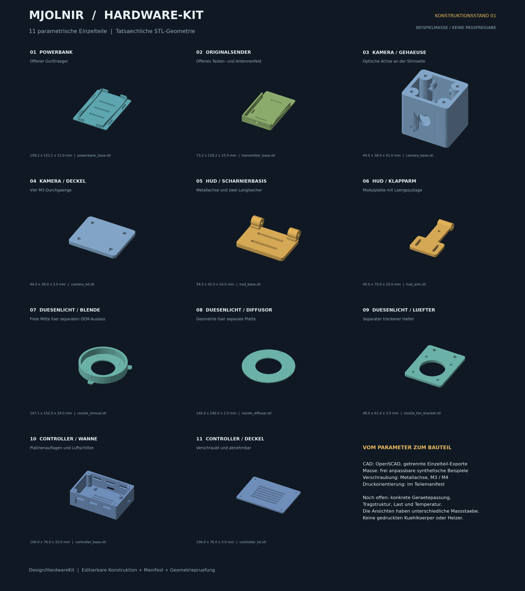

# Parametrischer Hardware-Bausatz

Elf editierbare Einzelteile fuer sechs Einbaugruppen: Powerbank, Originalsender,
Kamera, klappbarer HUD-Halter, trockene Duesenbeleuchtung und Serviceelektronik.
Die Teile sind echte Volumenmodelle mit Bohrungen, Gurtfuehrungen und getrennten
Deckeln. Sie verwenden ausschliesslich synthetische Beispielmasse und beanspruchen
weder eine Herstellerpassung noch eine Halo-Originalform.



Status: `HARDWARE_PROTOTYPES_NOT_VALIDATED`, `fabrication_approved=false`.
Der STL-Test prueft geschlossene, konsistent orientierte Kanten. Er ersetzt keine
Passprobe, Druckfreigabe, Temperaturmessung oder Lastpruefung.

## Dateien und Export

- [HardwareKit.scad](HardwareKit.scad): gemeinsame CAD-Quelle mit Teileauswahl.
- [Parameters.scad](Parameters.scad): direkt editierbare Parameter in Millimetern.
- [ExampleConfig.json](ExampleConfig.json): dieselben synthetischen Beispielwerte
  fuer den Projekt-Export; keine automatisch gemessenen Geraeteabmessungen.
- [Manifest.json](Manifest.json): alle elf erlaubten Selektoren, Dateinamen und
  Druckorientierungen; maschinenlesbar.
- [GeometryCheck.json](GeometryCheck.json): reproduzierbarer Kantencheck des
  Beispielstands mit Quellhashes. Eine Parameteraenderung braucht einen neuen Export.
- [RenderPreview.py](RenderPreview.py): erzeugt die Uebersicht direkt aus den
  exportierten ASCII-STLs; benoetigt Python mit Matplotlib und NumPy.

Einzelteil aus dem Repository-Hauptverzeichnis exportieren:

```bash
openscad --export-format asciistl -o /tmp/CameraBase.stl \
  -D 'component="camera"' -D 'part="base"' \
  Design/HardwareKit/HardwareKit.scad
```

Ohne `-D` erscheint eine raeumlich getrennte Gesamtvorschau. Die feste
Vorschauanordnung ist fuer die Beispielwerte gedacht; vergroesserte Teile koennen
in dieser Uebersicht ueberlappen. Einzelteil-Exporte bleiben getrennt.

Nach dem Export aller Manifest-Teile kann die Abbildung neu erzeugt werden:

```bash
python3 Design/HardwareKit/RenderPreview.py \
  --stl-dir /tmp/HardwareKit-Stl --output /tmp/HardwareKit-Preview.png
```

| Einbaugruppe | `component` | `part` | Enthaltene Konstruktion |
|---|---|---|---|
| Powerbank | `powerbank` | `base` | Offener Bodentraeger, kurze Seitenfuehrungen, geteilte Endanschlaege, vier Gurtschlitze |
| Originalsender | `transmitter` | `base` | Offener Traeger, zwei Befestigungsschlitze, zwei kleinere Sicherungsschlitze, freie Antennenseite |
| Kamera | `camera` | `base`, `lid` | Gehaeuse mit optischer Oeffnung, vier Platinenauflagen, Kabelausgang und verschraubtem Deckel |
| HUD | `hud` | `base`, `arm` | Zwei aeussere Scharnieraugen, mittleres Armauge, durchgehende Metallachse, Montage-Langloecher |
| Duesenlicht | `nozzle` | `shroud`, `diffuser`, `fan_bracket` | Ringblende mit freier Mitte, separater Diffusorring und trockener Luefterhalter |
| Controller | `controller` | `base`, `lid` | Belueftete Servicewanne, Platinenabstandshalter, Kabelausgang und abnehmbarer Deckel |

## Gemeinsame Masse und Befestigung

`clearance=0.6` bedeutet **0,6 mm je Seite** zwischen nominalem Geraet und
Fuehrung. Weiche Polster, Schrumpfschlauch, Stecker und Druckabweichungen sind
dadurch nicht automatisch abgedeckt. Die Beispiel-Schlitze nehmen einen
25-mm-Gurt auf; Dicke, Naehte und Schnallen muessen separat geprueft werden.

M3-Durchgaenge sind mit 3,4 mm, M4-Durchgaenge mit 4,4 mm modelliert. Bohrungen
nach dem Druck entgraten und ggf. vorsichtig aufreiben. Kamera und Servicewanne
haben unten sechseckige M3-Muttertaschen mit 6,6 mm Eckmass und 2,5 mm Tiefe.
Diese Passung vorab mit der realen Mutter pruefen; die Mutter muss vor dem
endgueltigen Aufsetzen auf eine Ruestungsplatte erreichbar bleiben.

Metallschrauben, Scheiben und Muttern uebernehmen die Verbindung; gedruckte
Gewinde sind nicht vorgesehen. Schraubenlaengen ergeben sich aus der tatsaechlichen
Klemmstrecke einschliesslich Scheiben und Mutter. Verbindungen duerfen Platinen,
Akkus und Leitungen nicht quetschen. Ein realer Gurt- oder Ruestungsadapter ist
abhaengig von der vorhandenen Tragstruktur und nicht mit der flachen CAD-Basis
bereits nachgewiesen.

| Baugruppe | Zusaetzliche Verbindungsteile, vorlaeufige Stueckzahl |
|---|---|
| Powerbank | 2 passende 25-mm-Gurte; weiche Auflage nach Geraetemass |
| Originalsender | 1 passender Gurt, 1 schmaler Sicherungsriemen, 1 Original-Fangriemen |
| Kamera | 4 lange M3-Deckelbolzen + 4 M3-Platinenschrauben; passende Muttern/Scheiben und Kabeltuelle |
| HUD | 1 M3-Metallachse, 2 Distanzhuelsen, Scheiben und Sicherungsmutter; je 2 Schraubverbindungen fuer Basis und Moduladapter; Fangleine |
| Lichtblende | 3 M4-Strukturverbindungen, 4 M3-Verbindungen fuer den ausgelegten Metalltraeger, 4 lange M3-Bolzen fuer den Diffusorring |
| Trockener Luefter | 4 zum realen Luefter passende Schrauben, 2 M4-Strukturverbindungen und separates Schutzgitter |
| Servicewanne | 4 lange M3-Deckelbolzen + 4 M3-Platinenschrauben; passende Muttern/Scheiben und Kabeltuelle |

Die Liste beschreibt Schraubstellen des CAD. Sie ersetzt keine endgueltige
Stueckliste mit realen Gewindelaengen, Materialauswahl und Kaufteilzeichnungen.

## Powerbanktraeger

Beispielgeraet: 78 x 145 x 28 mm. Die Oberseite ist vollstaendig offen; die
Fuehrungen ragen nur 10 mm ueber den Boden. Zwei Gurte laufen quer ueber das
Geraet und durch die seitlichen Flansche. Die Endanschlaege sind mittig geteilt,
damit ein Kabel prinzipiell aus beiden Stirnseiten austreten kann. Konkrete
Portpositionen, USB-Steckerlaenge, Kabelradius und Tasten sind nicht festgelegt.

Vor dem Anpassen muessen Geraetehuelle, reale Portpositionen, Kabelzugentlastung
und die Gurtzonen gemessen werden. Eine 2-mm-Polsterung erfordert entsprechend
groessere Aufnahmeabmessungen; sie ist kein Teil des Standardspiels. Die Rippen
halten den Boden offen, liefern jedoch keine rechnerisch bestaetigte Kuehlleistung.
Der Traeger hat weder Akku-Kontakte noch Ladeelektronik.

## Originalsender am Gurt

Beispielgeraet: 65 x 110 x 28 mm. Die Seite `+Y` bleibt offen; sie steht fuer die
am realen Sender zu bestimmende Antennenseite. Die Oberseite und damit ein
moegliches Tastenfeld sind offen. Ein Sender mit einer anderen Antennen- oder
Tastenlage muss anders ausgerichtet oder mit einem angepassten Traeger verwendet
werden. Die Senderposition ist keine Herstellerfreigabe fuer Unitree, Xiaomi oder
eine Drohnenfernsteuerung.

Die grossen Schlitze dienen dem Gurt, die kleinen Schlitze einer unabhaengigen
schmalen Geraetesicherung. Zuerst den Gurt einfaedeln, dann den Originalsender
einsetzen. Der Sicherungsriemen darf keine Taste dauerhaft druecken. Sender
zusaetzlich an dessen vorgesehenem Fangriemenpunkt sichern. Metallfolie, Carbon
oder leitfaehiger Lack sind im Funkfenster nicht vorgesehen; Reichweite und
Koerperabschattung sind mit dem Originalsystem zu pruefen.

## Kamera mit abnehmbarem Deckel

Der nutzbare Hohlraum betraegt im Beispiel 38 x 32 x 38 mm. Die Kamera blickt
entlang `-Y`; der 12-mm-Linsenausschnitt sitzt mittig in der Vorderwand. Vier
horizontale M3-Auflagen haben ein frei anpassbares Beispiel-Lochbild von
20 x 20 mm in der X/Z-Ebene. Die Auflageflaeche liegt 6 mm vor der inneren
Rueckwand. Diese Konstruktion passt nur zu einer entsprechend vermessenen
Sensorplatine bzw. deren Adapter. Ein USB-Kameragehaeuse braucht eine andere
Innenaufnahme.

Vier lange M3-Schrauben verbinden Deckel und Bodenmuttern. Weitere vier
M3-Verbindungen befestigen die Platine an ihren Auflagen; deren Schrauben und
Muttern muessen elektrisch isoliert Abstand zu Leiterbahnen halten. Der hintere
6-mm-Kabelausgang ist fuer ein Kabel, nicht fuer einen USB-Stecker gedacht.
Kabel vor der Platinenmontage einziehen oder die Oeffnung vergroessern.

Der optische Ausschnitt ist kein fertig ausgelegtes Sichtfeld: Brennweite,
Eintrittspupille, Linsenabstand und Randabschattung bleiben am realen Modul zu
pruefen. Waagerechte Bohrungen werden beim FDM-Druck nachgearbeitet; bei
Stuetzmaterial duerfen keine Reste in die Kamera gelangen.

## Klappbarer HUD-Traeger

Die Basis besitzt zwei Montage-Langloecher. Die aeusseren Scharnieraugen haben
52 mm Gesamtbreite. Der Arm besitzt ein 20 mm breites mittleres Auge und eine
40 x 26 mm Montageplatte mit zwei Laengsschlitzen. Der 65 mm lange Arm ist
fuer eine **leichte optische Einheit bzw. einen modulspezifischen Adapter**
gedacht; er ist keine Klemmaufnahme fuer eine komplette XREAL-Brille.

Einbaukoordinaten des Arms relativ zur Basis: Verschiebung um
`[0, hud_base_depth/2, 4]`. Dadurch liegen beide M3-Achsbohrungen auf derselben
X-Achse. Zwischen mittlerem und aeusserem Auge bleiben im Beispiel je 6 mm fuer
Metall-Distanzhuelsen und Scheiben. Deren Summe muss das reale Druckspiel
beruecksichtigen. Eine M3-Metallschraube als Achse, Scheiben und eine gesicherte
Mutter bilden die drehbare Verbindung; beispielhaft ist eine Laenge um 65 mm
zu pruefen. Gedruckte Zapfen sind nicht vorgesehen.

Die Schraube wird so eingestellt, dass der Arm beweglich bleibt. Klemmreibung
ist keine bestaetigte Positionsrastung. Rastung, Endanschlag, Lastmoment,
Gesichtsabstand und stoerungsfreies Wegklappen brauchen einen konkreten
Einbauversuch. Die kleine 4-mm-Oeffnung im Arm dient einer zusaetzlichen
Fangleine; die Fangleine darf den Freigabeweg nicht blockieren.

Basis flach drucken und die unteren Scharnierbereiche bei Bedarf stuetzen.
Beim Arm liegt nur die untere Zylindertangente auf dem Bett; die Montageplatte
beginnt bei Z=3 mm und braucht in dieser Orientierung Stuetzen oder eine
geeignete alternative Slicer-Orientierung. Die Anzeige muss sich unabhaengig
von der Stromversorgung aus dem Sichtbereich entfernen lassen.

## Trockene Duesen-Lichtblende

Das Beispiel hat 140 mm Aussendurchmesser, 24 mm Hoehe und eine **vollstaendig
freie 70-mm-Mitte**. Ein nur zur Abstandsdokumentation angesetzter OEM-Auslass
von 30 mm liesse 20 mm radialen Abstand. `nozzle_example_outlet_d` erzeugt
bewusst keinen Auslass und ist kein bestaetigter thermischer Mindestabstand.
Die Blende hat keinerlei mechanische Verbindung zu einem Heizer oder
Nebelgenerator. Nebelfuehrung und Originalauslass muessen separat montiert sein.

Drei M4-Laschen befestigen den Ring an einer geeigneten kalten Tragstruktur.
Vier M3-Bohrungen im unteren Ring sind ein beispielhaftes Befestigungsbild fuer
einen **gesondert ausgelegten Metall-Lichttraeger**. Sie sind keine direkten
LED-Star-Aufnahmen. Hochleistungs-LEDs brauchen Metallkuehlkoerper,
Waermeleitverbindung und eine gepruefte thermische Trennung vom Kunststoff.
Dieser Bausatz enthaelt keinen gedruckten Kuehlkoerper. Bei unbekannten
LED-, Metall- und Nebeltemperaturen bleibt der Aufbau ungeprueft.

Der flache 2-mm-Ring zeigt die Diffusorgeometrie. Er kann als Ausgangsform fuer
geeignetes Plattenmaterial dienen; ein gedruckter Ring erhaelt dadurch weder
definierte Lichtstreuung noch Hitzebestaendigkeit. Vier durchgehende M3-Bolzen
verbinden ihn mit der Blende. Die 70-mm-Mitte bleibt auch mit Deckring offen.

Der separate Luefterhalter verwendet ein **Beispiel-Lochbild** mit 32 mm
Abstand fuer einen 40-mm-Luefter und eine 30-mm-Luftoeffnung. Realen Luefter
vermessen. Die Platte wird ueber zwei M4-Loecher an einer separaten Struktur
befestigt, nicht unmittelbar am Nebelauslass. Finger-/Kabelschutzgitter und
Zugentlastung sind zusaetzliche Kaufteile. Der Luefter bleibt auf der trockenen
Seite; die Platte legt weder Luftmenge noch einen funktionierenden
Start-Nebeleffekt fest.

## Belueftete Controller-Servicewanne

Beispiel-Innenraum: 100 x 70 x 30 mm. Vier 6 mm hohe Platinenauflagen mit
58 x 49 mm Beispiel-Lochbild sind unabhaengig von den vier Deckelschrauben.
Die seitlichen Schlitze, der gelochte Boden und der geschlitzte Deckel bleiben
frei. Die Wanne ist kein geschlossenes Schutzgehaeuse gegen Schweiss,
Fluessigkeit oder leitfaehige Fremdkoerper.

Die Platine wird mit vier M3-Verbindungen montiert; der Deckel nutzt weitere
vier M3-Bolzen und Bodenmuttern. Die hintere Kabeloeffnung misst 16 x 8 mm.
Eine passende Tuelle und externe Zugentlastung muessen ergaenzt werden.
Leistungswiderstaende, Sicherungen, DC/DC-Wandler und Kabelradien bestimmen
den erforderlichen Innenraum. Eine konkrete Pi-/ESP32-/Treiberplatine muss
vorher vermessen werden; die Lochbilder sind keine Herstellerangaben.

## Noch benoetigte Messungen je Geraet

1. Aussenmasse einschliesslich Vorspruenge, Stecker und Polsterung.
2. Port-, Tasten-, Antennen- und Linsenposition mit benoetigtem Freiraum.
3. Montagebohrungen, Schraubengroessen und zulaessige Klemmstellen.
4. Gewicht, Schwerpunkt, Fangleinenpunkt und tragfaehiger Befestigungsgrund.
5. Tatsaechliche Temperatur unter Dauerbetrieb sowie Luft- und Kabelwege.

Die Assertions begrenzen ungueltige oder offensichtlich kollidierende
Parameterkombinationen. Sie fuehren keine automatische Festigkeitsrechnung,
vollstaendige Kollisionspruefung oder Zertifizierung durch.
