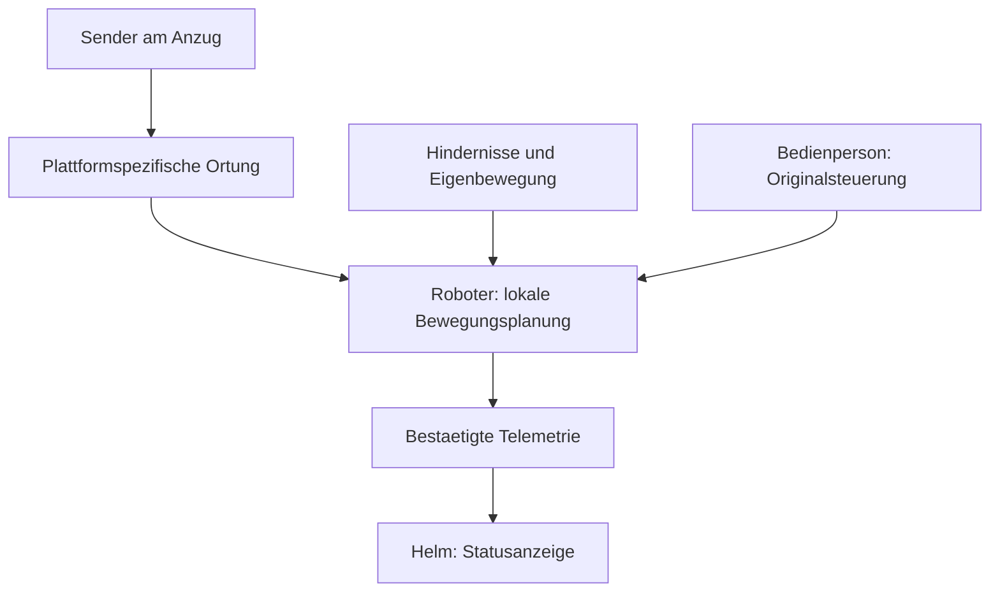

# Begleitsystem: Sender im Cosplay, Roboter und Drohne

Stand: 2026-09-09. Ziel ist eine inszenierte Begleitung des Spartans: folgen,
auf ein Signal anhalten und fuer Fotos eine Pose halten. Auswahl, Einbau und
Schnittstellen sind geplant; ein realer Roboter-/Flugadapter ist nicht
implementiert. Die vorhandene HUD-Bruecke verarbeitet nur Telemetrie.

## 1. Plattformwahl anhand belegter Funktionen

| Plattform | Belegt | Konsequenz fuer das Projekt |
| --- | --- | --- |
| DJI Mavic Air 2 | ActiveTrack 3.0 verfolgt ein ausgewaehltes Bildmotiv [1]. Steuerung ueber Originalfernbedienung, kein direktes Handy-WLAN zum Fluggeraet [2] | Fuer kontrollierte Aussenaufnahmen mit Pilot. Kein belegter nativer UWB-Tag-Folgemodus. Ein Sender am Anzug ersetzt ActiveTrack oder die Fernbedienung nicht. |
| Xiaomi CyberDog / CyberDog 2 | Xiaomi dokumentiert visuelles und UWB-Folgen mit gekoppelter Fernbedienung im oeffentlichen Softwarestack [3] | Geeigneter Kandidat, wenn Generation, Firmware, App, Entwicklerzugang und passende Fernbedienung zusammen bestaetigt sind. Die Softwaredokumentation belegt nicht jedes ausgelieferte CyberDog-2-Paket. |
| EngineAI T800 | Offizielles Native SDK dokumentiert T800-Zustandssteuerung sowie Simulator-/Hardwarepfad [4] | Eigenstaendiges Entwicklungsprojekt. Ein fertiger Sender-Folgemodus ist damit nicht belegt; Lokalisierung, Hindernisbehandlung und Begleitverhalten bleiben zusaetzlich zu entwickeln. |
| Unitree Go2 Pro | ISS2.0 und drahtlose Vektorpositionierung laut aktueller Variantenmatrix; Air hat diese Funktionen nicht [5] | Bevorzugter Kandidat fuer einen ersten Versuch mit nativer Senderbegleitung. Passende Originalfernbedienung und Lieferumfang bestaetigen. Pro ist laut Matrix nicht fuer eigene Sekundaerentwicklung vorgesehen. |
| Unitree Go2 X / EDU | X bietet eingeschraenkte, EDU vollstaendige Sekundaerentwicklung laut Hersteller [5] | Erst bei eigenem Verhalten oder direkter Telemetrieintegration waehlen; benoetigte APIs und Edition vor Kauf pruefen. SDK-Verfuegbarkeit beweist keinen Zugriff auf jede ISS-Messgroesse. |

Die erste Wahl fuer einen Sender-Prototyp ist damit ein geliehenes oder
vorgefuehrtes Go2-Pro-System mit Originalsender. Ein vorhandener CyberDog wird
zuerst gegen die Xiaomi-Dokumentation geprueft. T800 bleibt eine spaetere,
separat betreute Vorfuehrung. Es gibt keinen Anlass, drei Plattformen vor einem
erfolgreichen Einzelversuch zu kaufen.

## 2. Der Sender als austauschbare Anzugkassette

Die Ruestung bekommt eine kleine, werkzeuglos herausnehmbare Funkkassette am
seitlichen Hueft-/Guertelbereich. Bei hinterherlaufendem Roboter wird eine
hintere seitliche Lage mitgeprueft. Ihre endgueltige Position folgt den
Herstellervorgaben und dem Funkversuch, nicht einem universellen Abstandswert.

- Originalsender zunaechst vollstaendig erhalten, inklusive Antennen, Akku,
  Tasten und Gehaeuse. Einbau muss Bedienung mit Handschuhen erlauben.
- Funkfenster aus unbeschichtetem Kunststoff; kein Metall, metallischer Lack,
  Carbon oder Akku unmittelbar vor der Antenne. Metallische Anzugdetails,
  Koerperabschattung und Drehungen im tatsaechlichen Aufbau pruefen.
- Befestigung am tragenden Gurt statt an einer lose beweglichen Aussenschale;
  runde Kanten, Zugentlastung und erreichbarer Lade-/Wechselzugang.
- Eigener Senderakku: Ausfall von Helm, RGB oder Nebler darf den Sender nicht
  unbemerkt ausschalten. Laufzeit und Ladezustand separat erfassen.
- Position und Masse bleiben projektspezifisch. Einbauraum erst nach Wahl und
  Vermessung des Originalsenders in Detail-CAD uebernehmen.

Ein gemeinsames aeusseres Gehaeuse kann mehrere plattformspezifische Module
aufnehmen. Ein gemeinsames Funkprotokoll fuer DJI, Xiaomi und EngineAI ist nicht
nachgewiesen. Ein AirTag, BLE-Beacon oder beliebiges UWB-Board ist deshalb kein
universeller Ersatz fuer den jeweiligen Originalsender.

## 3. Ortsmessung, Navigation und Anzeige trennen



Das Schema beschreibt den Bodenroboter. Bei DJI bleibt die Originalfunkstrecke
mit Pilot und Fernbedienung bestehen. Ein optionaler spaeterer Senderpfad wuerde
ueber eine passende App und modellkompatible SDK-Funktionen laufen, nicht ueber
den UDP-Port der HUD-Bruecke.

Fuer eine eigene Ortung sind vier Aufgaben zu unterscheiden:

1. **Identitaet:** Der gekoppelte Sender ist das Ziel. Nach Verlust kein
   automatischer Wechsel zur naechsten Person oder zum naechsten Sender.
2. **Relative Lage:** Abstand und Richtung mit Messalter und Guete. Ein einzelnes
   UWB-Distanzpaar liefert geometrisch nur einen Radius, keine eindeutige
   Peilung. Noetig sind etwa ein passendes AoA-System, mehrere ausreichend
   verteilte Messpunkte oder eine zusaetzliche Richtungsmessung mit Fusion.
3. **Freier Weg:** Der Roboter prueft seinen eigenen Bewegungsraum. Eine
   Funkposition hinter einer Wand ist kein befahrbares Ziel. UWB ersetzt weder
   Hinderniserkennung noch eine belastbare Behandlung von Treppen/Abgruenden.
4. **Bezugsrahmen:** Roboterpeilung wird fuer das HUD in den Koerper-/Helmrahmen
   umgerechnet. 0 Grad im HUD bedeutet voraus aus Sicht des Traegers. Ein
   ungepruefter Kompasswert im metallischen Anzug reicht dafuer nicht.

Ein [Qorvo DWM3001CDK](https://www.qorvo.com/products/ek/DWM3001CDK) ist ein
Entwicklungsboard fuer UWB-Entfernungs-/Ortungsversuche, kein fertiger
Roboter-Follow-Adapter. Ein Kit enthaelt ein Board. Zwei Boards eignen sich fuer
den ersten Distanzversuch; eine brauchbare mobile Peilung entsteht daraus nicht
automatisch. Fuer einen nativen Go2-/Xiaomi-Versuch werden solche Boards nicht
zusaetzlich benoetigt.

## 4. Bedienung und inszenierte Leibgarde

Die folgende Tabelle ist eine Anforderung an einen spaeteren Adapter. Sie
behauptet keine gleichnamigen Funktionen in jeder Hersteller-App.

| Zustand | Gewuenschtes Verhalten | Freigabe/Abbruch |
| --- | --- | --- |
| PARK | Keine Folgebewegung; Ausgangszustand nach Neustart | Bewusste Bedienfreigabe erforderlich |
| FOLLOW | Ein gekoppeltes Ziel, getesteter Abstand und begrenztes Tempo | Nur bei gueltiger Ortung, freiem Weg und aktiver Aufsicht |
| HOLD | Folgebewegung beenden; herstellergemaess stabil bleiben | Wiederaufnahme nur durch bewusste Freigabe |
| POSE | An Ort und Stelle Licht-/Soundinszenierung und gepruefte Pose | Keine automatische Annaeherung an Besucher |
| LOST / BLOCKED | Kein Nachjagen, kein blindes Suchen um Hindernisse | Lokale Stopplogik; nach Wiedererkennung weiterhin HOLD |

Am Anzug ist eine gut ertastbare **HOLD-Anforderung** sinnvoll; die unabhaengige
Originalsteuerung bleibt bei einer begleitenden Bedienperson. Ob der
Originalsender einen geeigneten Taster bietet, ist am konkreten Modell zu
pruefen. Ein eigener WLAN-Taster ist kein nachgewiesener Not-Halt.

Eine LED bestaetigt HOLD erst nach Rueckmeldung des Geraets. Ohne Rueckmeldung
lautet der Status UNBEKANNT. Bei einem laufenden Zweibeiner kann abruptes
Abschalten der Motoren einen Sturz ausloesen. Bei einer fliegenden Drohne kann
es zum Absturz fuehren. Deshalb keine gemeinsame Abschaltleitung fuer alle
Plattformen: Stabilisieren, Landen und Notfallablauf folgen dem jeweiligen
Herstellerverfahren und der Situation.

Abstand, Geschwindigkeit und Timeout folgen realen Messungen und
Herstellervorgaben. Fuer Bodenroboter umfasst die Planung mindestens Reaktions-
und Bremsweg, Ortungsfehler und Reserve. Ein pauschaler 1-m-Abstand wird nicht
festgelegt. Enge Bereiche werden nicht durch kleineres Nachlaufmass geloest.
Mehrere Begleiter brauchen zusaetzlich gegenseitige Kollisionsvermeidung;
ein Sender macht aus mehreren unabhaengigen Follow-Modi keine Formation.

Als Halo-Gestaltung ist ein fiktiver UNSC-Unterstuetzungsroboter passend. Eine
abnehmbare leichte Verkleidung darf Sensorfelder, Antennen, Kuehlung und
Gelenkraum nicht verdecken; keine starren Verbindungen zur getragenen Ruestung.
Die Verbindung zur Halo-Welt ist hier eine eigene Inszenierung, kein belegtes
kanonisches Begleitgeraet. Xiaomis offizielle
[CyberDog-2-Geometriedaten](https://github.com/MiRoboticsLab/Cyberdog_MD) koennen
nach Lizenzpruefung die Planung einer abnehmbaren Verkleidung unterstuetzen.

## 5. DJI-Pfad und Wechselwirkung mit Nebel

Die [offizielle DJI-Android-SDK-Sammlung](https://github.com/dji-sdk/Mobile-SDK-Android)
enthaelt Automatisierungsbeispiele. Welche APIs mit Mavic Air 2, konkreter
Firmware, Android-Version und Fernbedienung funktionieren, muss fuer einen
eigenen Adapter einzeln belegt werden. Allgemeine SDK- oder FollowMe-Beispiele
sind keine modellbezogene Freigabe. Aktuell gibt es im Repo keinen solchen
Adapter und keine implementierte GPS-/UWB-Folgeflugsteuerung.

Der erste Aussenversuch nutzt deshalb ActiveTrack unter Kontrolle eines Piloten.
Die Ruestung mit breiten Schultern und spiegelndem Visier ist als konkretes
Kameraziel zu testen. Trackingverlust, Stoppen, Landen und Sicht auf den Flugweg
sind Teil der Probe. Start/Landung neben dem Koerper oder vom Ruestungsruecken
sind nicht Teil dieses Entwurfs.

DJI raet auf seiner Supportseite von Flug in Nebel ab, weil die Sichtsysteme
beeintraechtigt werden koennen [2]. Der Anzug-Nebeleffekt bleibt deshalb bei
Drohnen-Folgeaufnahmen aus. Fuer den Bodenroboter werden Nebel, dunkle Flaechen,
Spiegelungen und RGB ebenfalls als Sensortests behandelt; ein UWB-Sender macht
optische Hindernissensoren nicht unempfindlich.

## 6. Aussendreh und Messe getrennt planen

- **Aussendreh:** Kontrollierter Bereich, ein Bodenroboter oder ein beaufsichtigter
  Drohnenflug als eigener Ablauf. Bei Flug bleiben Ort, Kategorie, Geozone und
  notwendige Berechtigungen konkret zu pruefen. Die EASA erlaeutert die
  Einschraenkungen fuer unbeteiligte Personen und Menschenansammlungen [6].
- **Ausstellerdemo:** Definierte Vorfuehrflaeche, eigene Betreuung, dokumentierte
  Geraete-/Abbruchfunktionen und veranstaltungsbezogene Abstimmung. Ein
  Herstellerstand mit Robotervorfuehrung belegt keine Erlaubnis fuer freie
  autonome Begleitung auf Besuchergangen.
- **Besuchergang:** Im Projekt kein selbststaendiger Folge- oder Flugmodus
  vorgesehen. Fuer einen Ortswechsel gelten Transport oder ein separat
  abgestimmter, betreuter Ablauf.

Das ist die Projektplanung, keine behauptete pauschale Hausregel fuer IFA oder
gamescom. Fuer beide liegen noch keine Freigaben zu diesem Aufbau vor.
[Veranstaltungspruefung](Convention-Regeln.md) und
[Messebetrieb](Mjolnir-Messebetrieb.md) halten Ausgabe und Betriebsumfang fest.

## 7. Vorhandene Telemetriebruecke und ihre Grenzen

[robot_bridge.py](../../Code/HelmetControl/robot_bridge.py) nimmt JSON-Datagramme
fuer genau einen ausgewaehlten Begleiter an. Es sendet keine Fahr-, Flug- oder
HOLD-Befehle. Ein geraetespezifischer Senderprozess muss echte SDK-Daten erst
bereitstellen; Funktionen wie `read_tag_bearing()` sind nicht implementiert.

Beispiel eines vollstaendigen Snapshots:

```json
{
  "robot_battery": 64,
  "robot_distance_m": 2.3,
  "robot_bearing": 130,
  "robot_state": "follow"
}
```

Abstand ist in Metern, Peilung in Grad im Traegerrahmen, Akku in Prozent. Nur
vorhandene, gemessene Felder senden. Fehlende Felder bedeuten unbekannt; keine
Nullwerte erfinden. `guard` ist im alten HUD lediglich die Darstellung einer
stationaeren Show-Pose, keine Bewachungsfunktion.

Die Bruecke ist eine Anzeige-Demo: kein authentifiziertes Funkprotokoll, kein
Nachweis fuer die Aktualitaet der urspruenglichen Sensormessung und keine
sicherheitsgerichtete Verbindung. Eine IP-Auswahl ersetzt keine Authentisierung.
Fuer Netzwerkversuche ein separates vertrauenswuerdiges Netz und einen
festgelegten Sender verwenden. Details der Kommandozeile: `--help`.

Der Timeout entfernt alte Roboterdaten nur, solange der Brueckenprozess laeuft.
Bei Prozessabsturz kann die HUD-Datei weiter existieren. Ausserdem schreiben
bestehende Sensormodule ebenfalls `hud_state.json`; atomarer Dateiersatz loest
keine konkurrierenden Lese-/Schreibzugriffe. Bis zu einem gemeinsamen Aggregator
oder getrennten Quelldateien die Bruecke mit eigener Testdatei beziehungsweise
einem einzelnen Schreiber betreiben. Eine Anzeige darf deshalb nie als
bestaetigter Bewegungsstopp verwendet werden.

Hardwarefreier Selbsttest, ab Repository-Wurzel:

```bash
python3 Code/HelmetControl/robot_bridge.py --selftest
python3 -m unittest discover -s Tests/Automation -p 'test_robot_bridge.py' -v
```

Fuer den spaeteren Live-Adapter fehlen noch: authentisierte Sitzungs-/Geraete-ID,
Sequenznummer und nachvollziehbares Messalter, definierte Koordinatentransformation,
verifizierte Zustandsrueckmeldung sowie Lokalisierungs-/Abbruchtests auf dem
konkreten Geraet. Die Konfiguratorauswahl erzeugt bislang keinen Begleitadapter.

## 8. Einkauf und naechste reale Versuche

Die [Begleit-Hardwareliste](../../Materials/Mjolnir-Begleitsystem.md) trennt
Originalsender, Einbauzubehoer und optionale Eigenentwicklung. Vor Roboterauswahl
werden keine proprietaeren Funkmodule oder Entwicklerlizenzen fest bestellt.

1. Genaue Plattform, Edition, Firmware und Originalsender festhalten.
2. Nativen Folgemodus ohne Ruestung in einem freien Testbereich vorfuehren lassen.
3. Stopptaste, Senderverlust, leeren Senderakku und Wiederverbindung pruefen;
   Wiederverbindung darf im Projekt nicht unbeabsichtigt Bewegung starten.
4. Sender erst offen am Gurt, dann in der Funkkassette testen; Drehen, Buecken,
   Abschattung und Helm-/Nebler-/RGB-Betrieb getrennt protokollieren.
5. Reaktions-/Bremsweg und Ortungsfehler messen; daraus Betriebsgrenzen festlegen.
6. HUD-Daten erst nach belegter SDK-Ausgabe anbinden. Bei Hersteller-Follow ohne
   Telemetriezugang bleibt die Helm-Anzeige fuer diesen Status unbekannt.
7. Eine betreute Ausstellung getrennt vom freien Test dokumentieren.

## Quellen

[1] [DJI: Mavic Air 2 und ActiveTrack](https://www.dji.com/media-center/announcements/get-ready-to-up-your-creative-game-with-the-new-dji-mavic-air-2)

[2] [DJI: Mavic Air 2 Support, Fernbedienung und Sichtsysteme](https://www.dji.com/support/product/mavic-air-2)

[3] [Xiaomi: Algorithm Manager, visuelles und UWB-Folgen](https://github.com/MiRoboticsLab/blogs/blob/rolling/docs/cn/algorithm_manager_cn.md),
[UWB-Treiber](https://github.com/MiRoboticsLab/blogs/blob/rolling/docs/cn/cyberdog_uwb_cn.md)

[4] [EngineAI: offizielles Native SDK](https://github.com/engineai-robotics/engineai_robotics_native_sdk)

[5] [Unitree: Go2 und Variantenmatrix](https://www.unitree.com/go2/)

[6] [EASA: Fluege nahe Personen](https://www.easa.europa.eu/en/light/topics/flying-drones-close-people)
