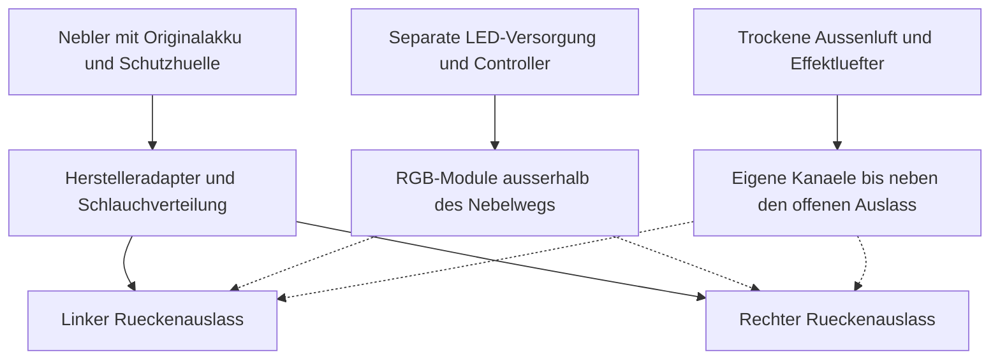

# Schubduesen: Nebelmodul mit beleuchtetem Auslass

Stand: 2026-09-09. Optionaler Effekt fuer unterschiedliche Projektprofile.
Entwicklungsentscheidung: kompakter Fertig-Nebler mit Originalfluid und
vorgesehener Schlauchfuehrung, ergaenzt um separat versorgtes RGB-Power-Licht
und optionale trockene Effektluefter am offenen Auslass.
Der Effekt erzeugt sichtbaren Nebel, keinen Antrieb. Die Integration in die
Ruestung ist noch nicht physisch erprobt.

## Auswahl und Fluid

**Arbeitsbasis: PMI SmokeNINJA Pro, beim Neukauf genaue V2-/Bundle-Version
pruefen, mit PMI Smoke Vest.** Der Hersteller bietet diese Kombination fuer
Nebel am getragenen Kostuem an. Das Cosplayer Bundle umfasst Nebler, Weste,
Kammer, Cloud-Fluid und Fernbedienung. Die Weste allein erzeugt keinen Nebel.
Lieferumfang und lieferbare Revision vor der Bestellung abgleichen.
[Hersteller: Smoke Vest und Bundles](https://pmigear.com/products/pmi-smoke-vest-on-body-smoke-system).

PMI nennt fuer **Cloud Formula pflanzliches Glycerin und Propylenglykol**.
Verwendet wird das zur Kammer freigegebene Originalfluid. Eine selbst gemischte
Glycerin/PG-Mischung ist fuer diesen Aufbau nicht vorgesehen. Lebensmittelqualitaet
ist keine Freigabe fuer beliebige Erhitzung oder das Einatmen des Aerosols.
[Hersteller: Fluid und Betrieb](https://pmigear.com/pages/troubleshoot).

Fuer kuerzer sichtbare Effekte kommt spaeter das **Vanishing Formula Kit** infrage.
Es hat eine eigene Kammer und Duese; Fluide nicht mischen. Die Kombination dieses
Kits mit der konkreten Schlauchfuehrung muss vor einer Umstellung geklaert werden.
Es ist deshalb keine vorbehaltlos kompatible Austauschfuellung der Arbeitsbasis.
[Hersteller: Vanishing Kit](https://pmigear.com/products/pmi-vanishing-formula-kit).

Die fruehere Aussage, kleine Foto-Nebler seien generell nicht fuer Kostueme
geeignet, ist damit korrigiert. Ebenso entfallen pauschale Laufzeitangaben und
angebliche USB-C-/GPIO-Trigger ohne Nachweis fuer das konkrete Geraet.

## Mechanischer Aufbau

Ein Nebler speist zunaechst zwei Rueckenauslaesse. Das ist ein Entwurfsziel;
Dichte und Gleichmaessigkeit nach der Aufteilung muessen gemessen werden.

- Geraet in seiner vorgesehenen Schutzhuelle an einer herausnehmbaren Kassette
  befestigen. Der Ruestungstraeger nimmt die Zusatzmasse auf; duenne Zierschalen
  dienen nicht als alleinige Befestigung. Hersteller-Belueftung freihalten.
- Schutzhuelle und Nebler bleiben zugaenglich. Keine luftdichte Foam-Kapsel und
  kein improvisierter Heizblock. Einbauabstaende und erlaubte Betriebslagen aus
  der Anleitung der gelieferten Revision uebernehmen.
- Original-Schlauchmaterial und freigegebene Adapter als Ausgangspunkt nutzen.
  Die Weste verteilt Nebel teilweise ueber gelochte Leitungen: fuer konzentrierte
  Duesen sind passende geschlossene Leitungsabschnitte erforderlich. Vorhandene
  Verteilloecher nicht wahllos zukleben; keine Staudruckerhoehung erzwingen.
- Beide Wege kurz und moeglichst aehnlich fuehren. Schlauchinnendurchmesser,
  Mindestbiegeradius und zulaessige Laenge am konkreten System festlegen.
  Keine willkuerliche Verengung am Ende und keine Absperrventile im Nebelauslass.
- Schlaeuche duerfen Gelenke, Fronttueren, Notausstieg oder Schnellverschluesse
  nicht kreuzen und blockieren. Geeignete leicht trennbare Serviceverbindungen
  verwenden; deren Trennkraft und Dichtigkeit separat pruefen.
- Kondensat an zugaenglichen Stellen kontrollieren und nach Herstelleranleitung
  entfernen. Kein automatischer Ruecklauf von verschmutztem Kondensat in die Kammer.
- Auslaesse vom Helm, der Ansaugluft der Helmlueftung, Haut und Publikumswegen
  weg ausrichten. Halo-Referenz entscheidet ueber die Form und Position; ein
  zusaetzliches Jetpack ist nicht fuer jede Ruestungsreferenz originalgetreu.
- RGB-Module optisch auf den Nebel richten, elektrisch und mechanisch vom feuchten
  Kanal trennen. Diffusor, Kleber und Schalenmaterial erst nach Temperaturprobe
  festlegen. Papier/Foam im warmen Auslass ist kein vorgesehener Diffusor.

## Versorgung und Ausloesung

Der Nebler bleibt auf seiner vorgesehenen Hersteller-Stromversorgung. Die
Ruestungselektronik schaltet weder Heizelement noch Akku. Laden und Betrieb
richten sich nach der Anleitung; keine gemeinsame 5-V-Leistungsannahme fuer
Nebel und LEDs. **Kein zusaetzlicher Luefter wird in den Nebelschlauch gesetzt.**
Die unten beschriebenen Effektluefter besitzen unabhaengige trockene Luftwege;
sie veraendern keine interne Geraetelueftung und druecken nicht in die
Herstellerkammer oder deren Schlauchverteiler.

Zunaechst erfolgt die Ausloesung ueber den Originaltaster bzw. die Original-
Fernbedienung. Start-/Stopverhalten, Funkverlust und ein haengender Taster werden
am Tisch geprueft. Der Hauptschalter muss erreichbar bleiben. Nebel und Licht
werden in dieser Stufe manuell koordiniert; eine automatische Synchronisation
ist noch nicht implementiert. Es gibt keinen universellen USB-C-Trigger und
keinen blind startenden/stoppenden Toggle-Ausgang im Projektcode.

Fuer spaetere Synchronisation muss ein dokumentierter externer Eingang der
exakten Geraeteversion vorliegen. Erst danach folgen elektrische Anpassung,
Zeitbegrenzung und Ausfalltests. Betriebsbereit-Anzeige und Temperatur-/Leerlauf-
Schutz des Geraets werden nicht umgangen.

Fuer den ersten ungetragenen Versuch ist **ein kurzer Impuls von etwa einer
Sekunde** ein gestalterischer Startpunkt, sofern der Geraetemodus dies erlaubt.
Danach vollstaendig stoppen und gemaess Geraeteanzeige/Anleitung warten. Diese
Angabe ist weder eine Herstellergrenze noch ein erlaubter Dauerzyklus. Kein
periodischer Automatiknebel im Messepublikum.

## RGB-Power-Licht und trockener Startwind

Arbeitsbasis fuer den hellen Farblichtanteil ist je Auslass ein 20-mm-RGB-Star
auf echtem Metallkuehlkoerper. Die zwei Auslaesse werden als symmetrisches Paar
mit drei Konstantstromkanaelen betrieben. Die
[Lichtmodul-Auslegung](Mjolnir-Lichtmodule.md) beschreibt die Reihenschaltung,
350-mA-Prototypenstufe, 15-V-Versorgung, Temperaturmessung und optische
Abschirmung. Ein kleiner Pixelring kann eine umlaufende Animation ergaenzen;
er ist eine eigene Last und wird nicht ungeprueft als Power-Licht verbucht.

Jede Lichtkassette sitzt seitlich ausserhalb des Nebelkanals. Die Optik zeigt
in den Nebel unmittelbar nach dem freien Austritt. Nebel darf nicht auf die
LED-Platine oder durch den Kuehlkoerper geleitet werden. Eine austauschbare
Schutzscheibe trennt den trockenen Lichtraum von der feuchten Umgebung;
Abstand, Dichtung, Temperatur und Ablagerungen werden am Muster geprueft.
Der freie Querschnitt des Hersteller-Auslasses bleibt erhalten.

Fuer den Startwind ist **je Auslass ein Noctua NF-A4x10 5V PWM** als leiser
Tischversuchs-Kandidat vorgesehen. Der Hersteller nennt maximal 0,35 W,
8,9 m3/h freien Luftstrom und 1,95 mm Wassersaeule maximalen statischen Druck.
Freier Luftstrom und maximaler Druck gelten nicht gleichzeitig; im Kanal
faellt der Durchsatz geringer aus. Der kleine Axialluefter ist kein
leistungsstarkes Geblaese fuer lange enge Leitungen.
[Noctua: technische Daten](https://www.noctua.at/en/products/nf-a4x10-5v-pwm/specifications).

Der mechanische Aufbau besitzt fuer jeden Luefter einen eigenen Ansaugschlitz
an der trockenen Aussenseite des Rueckenmoduls, ein Schutzgitter und einen
kurzen, weiten Kanal. Dessen Ende liegt neben dem Nebelaustritt, stromabwaerts
zur Umgebung offen. Keine Manschette dichtet die zwei Wege zu einer gemeinsamen
Druckkammer ab. Das Luftbild darf den Nebel vor der Kamera leicht mitnehmen,
ihn aber nicht in die Ruestung, zur Helm-Ansaugung oder zur Quelle zurueckdruecken.
Ein Wechsel von Nebelmenge oder Rueckstroemung beim Luefterstart bedeutet:
Versuch stoppen und Auslassgeometrie korrigieren.

Die 5-V-Motorversorgung bleibt konstant; die Drehzahlregelung nutzt den
separaten PWM-Eingang. Noctua verlangt dafuer etwa 25 kHz, zulaessig 21-28 kHz,
und beschreibt die geeignete CMOS-Ansteuerung. Das ist eine andere Frequenz
als die LDD-Lichtdimmung. Tachosignale bleiben bei zwei Lueftern getrennt.
[Noctua: Mikrocontroller-Ansteuerung](https://www.noctua.at/en/support/faqs/microcontroller-guide-pwm-setup-and-rpm-monitoring).
Die vorhandenen Effekt-Sketches werden nicht ohne Timer-, Pegel- und
Verdrahtungspruefung als kompatibel eingestuft.

## Ablauf fuer ein gestelltes Startfoto

Der folgende Ablauf ist ein gestalterischer Versuchsplan fuer den freigegebenen
Aufnahmebereich. Die Prozentwerte beziehen sich ausschliesslich auf eine zuvor
eingemessene erlaubte Fotostufe, nicht auf unbeschraenkten Chip-Maximalstrom.

| Phase | RGB-Licht | Trockener Effektluefter | OEM-Nebel |
| --- | --- | --- | --- |
| Bereit | Schwache eingemessene Grundfarbe | Aus | Aus |
| Start, ca. 0-0,8 s | Weicher Anstieg zur Fotostufe | Anlaufen ab ermittelter sicherer Startdrehzahl, dann ansteigen | Separater manueller Impuls nach Geraetebereitschaft |
| Fotomoment, ca. 0,8-1,8 s | Stabile Farbe und Helligkeit | Konstante erprobte Stufe | Impuls gemaess freigegebenem Geraetemodus; Laufzeit nicht aus dieser Tabelle ableiten |
| Ausklang, ca. 1,8-3 s | Weich abblenden | Drehzahl senken und stoppen | Aus; Stopzustand pruefen |
| Abbruch | Licht abschalten | Effektluefter stoppen | Separat ueber OEM-Bedienung stoppen |

Diese Zeiten sind keine programmierten Nebelbefehle oder Herstellergrenzen.
Nebel bleibt manuell ueber Originaltaster/Fernbedienung bedient. Unabhaengige
Starttaster fuer Fotoeffekt und OEM-Nebel muessen erreichbar sein; die konkrete
Originalfernbedienung darf Halten, Greifen und Notausstieg nicht behindern.
Eine gemeinsame automatische Startsequenz wird erst nach nachgewiesener
Geraeteschnittstelle implementiert. Es gibt keine Behauptung eines vorhandenen
GPIO-, USB-C- oder Bluetooth-Start-/Stopprotokolls.

Der Abbruch der Show schaltet die Komfortlueftung im Helm und Anzug **nicht**
ab. Die Lichtkuehlung darf nur dann mit abgeschaltet werden, wenn der
Nachlaufbedarf thermisch geklaert ist. Ein Haupt-Aus fuer alle Stromkreise bleibt
zusaetzlich erreichbar; anschliessend Helm oeffnen und den Betrieb beenden.

## Zusatzerprobung fuer Licht und Luft

1. Nur trockenes Lichtmodul: Strom, Spannung, Resetverhalten und Temperatur
   pruefen; Strahlrichtung aus Besucher- und Trageperspektive kontrollieren.
2. Nur Effektluft: Anlaufen, Stoppen, Gitter, Lautstaerke und austretenden Luftweg
   pruefen. Kein Nebelschlauch ist Teil dieses Kreises.
3. Nur OEM-Nebel in freigegebener Konfiguration: Flussbild und Kondensat aufnehmen.
4. Kombination am ungetragenen Rueckenmodul: pruefen, ob Luft den Nebel unerwuenscht
   zuruecktraegt, zerreisst oder bereits am Auslass stark verduennt.
5. Fotos mit realem Hintergrund und vorgesehenen Verschlusszeiten: Farbaussteuerung,
   PWM-Streifen und Rollingshutter-Artefakte dokumentieren. Details stehen in der
   [Lichtmodul-Anleitung](Mjolnir-Lichtmodule.md).
6. Erst nach diesen Proben integrieren: Kabel-/Schlauchfreiheit beim Oeffnen,
   Zugang zu allen Stopptastern und unveraenderte Frischluftversorgung kontrollieren.

## Offene Messwerte und Auslegung

| Groesse | Ermittlung und Auswirkung |
| --- | --- |
| Geraet inkl. Akku, Fluid und Huelle | Aussenmasse und tatsaechliche Masse bestimmen; Kassette und Traeger danach auslegen |
| Schlauchwege links/rechts | Laenge, Querschnitt, Biegungen und Verzugsfreiheit aufnehmen |
| Auslass und Halterung | Temperatur bei Referenzimpuls und Wiederholungsfolge messen; Grenzen nach Materialdaten und Geraeteanleitung festlegen |
| Fluidaustrag | Verbrauch aus gewogener/dokumentierter Betriebsserie; Restvolumen und Reserve bestimmen |
| Nebelbild | Einzelauslass, beide Auslaesse, Tageslicht, Hallenlicht und Bewegung vergleichen |
| Akku | Nutzbare Energie und reale Impulszahl messen; Displaylaufzeit nicht als Nebelzeit interpretieren |
| LED-Strom | LED-Datenblatt und Messung bei maximal erlaubter Helligkeit; Kabel, Stecker und Sicherung daran auslegen |
| Trockene Effektluft | Einbau-Durchsatz, Drehzahl, Anlaufverhalten und Nebel-Rueckstroemung; keine Freiluftkennzahl als reale Kanalwirkung annehmen |
| Lichtkassette | Temperatur, Reflexionen, Kondensat und Strahlrichtung in allen erlaubten Posen |

Rechenweg fuer getrennte Stromkreise: `E_Wh = P_W * t_s / 3600` je Impuls.
Bereitschaftsleistung und Verluste kommen dazu. Fuer LEDs gilt `I_A = P_W / U_V`.
Ohne gemessene Leistung und nutzbare Akkuenergie wird keine Laufzeit zugesagt.
Im Budget bleiben unbekannte Massen `null`; sie sind nicht null Gramm.

## Konfiguration und Einkauf

Im [Profil-Konfigurator](../../web/configurator/) gibt es unter Nebeleffekt:
`none`, `pmi-cloud`, `external` und `water-mist`. Alte Profile starten mit `none`.
Die Auswahl dokumentiert den Bauweg und verweist hierher; sie schaltet keine
Hardware und erzeugt keine thermisch gepruefte Einbaugeometrie.

Die [Zusatz-BOM](../../Materials/Mjolnir-Nebel-BOM.json) enthaelt das PMI-Beispiel.
Im [Budgeteditor](../../web/budget/) fuegt **Nebelmodul ergaenzen** dessen
Positionen hinzu, ohne die vorhandene Liste zu ersetzen. Doppelte Modul-IDs
werden abgelehnt. Bereits vorhandene LEDs, Controller und Versorgung koennen
entfallen; die Ausstattung muss dafuer real vorhanden und ausreichend sein.

[Beschaffungsplan mit Kosten](../../Materials/Mjolnir-Nebel-Einkauf.md).
Fuer RGB-Power-Licht und trockene Effektluefter gilt die
[zusaetzliche Licht-Einkaufsliste](../../Materials/Mjolnir-Licht-Einkauf.md).
FOG03-FOG06 werden dort mit vorhandenen Teilen abgeglichen; einfache 5-V-Ringe
und ihre Versorgung sind kein elektrisch passender Ersatz fuer den
15-V-Konstantstromaufbau. Die generische Nebel-BOM bleibt eine guenstige
Ausgangsvariante und wird durch die neue Liste nicht automatisch ersetzt.
Die Basis-BOM enthaelt das Nebelsystem nicht automatisch. Die Auswahl im
Koerperprofil aendert eine getrennte Budgetdatei nicht ohne diese Aktion.

## Freigabe und Alternativen

Fuer einen getragenen Aufbau zuerst das [Nebel-Pruefprotokoll](../../Tests/TestReports/Mjolnir-Nebel-Abnahme.md)
am Tisch und dann am vollstaendigen Kostuem abarbeiten. Nebel ist auf einer
Messe nicht automatisch erlaubt, auch Ultraschall-Wassernebel nicht. Fuer
Gamescom/IFA ist eine konkrete Freigabe der zustaendigen Veranstaltungstechnik
fuer Ort, Geraet, Fluid und Vorfuehrablauf einzuholen. Melder und Lueftung bleiben
im normalen Betrieb; die Freigabe wird nicht aus der Fluidchemie abgeleitet.
Bis dahin funktioniert die Vorfuehrung ausschliesslich mit Licht.

`external` verlegt die Quelle an den Ausstellungsstand; Schlauchbindung,
Stolperstellen und Trennung vor Bewegungen werden gesondert geplant. Das ist
keine automatisch passende tragbare Loesung.

`water-mist` bleibt eine guenstige Versuchsvariante fuer feinen Wassernebel.
Ultraschall zerstaeubt Wasser, statt es zu verdampfen. Nur fuer Wasser bestimmte
Module erhalten kein Glycerin/PG-Fluid. Dichtigkeit, Hygiene, Kondensat und
Sichtbarkeit bleiben auch dort zu pruefen. Fuer den gewuenschten deutlichen
Duesenstoss ist das PMI-System die bevorzugte Arbeitsbasis.

## Quellen und Dokumentationsstand

Herstellerseiten oben geprueft am 2026-09-09. Zusaetzlich:
[PMI-Anleitung und Tutorials](https://pmigear.com/pages/smokeninja-pro-tutorial).
Der dortige PDF-Abruf war in dieser Recherche nicht erfolgreich. Die Anleitung
zur tatsaechlich gelieferten Revision sowie das Fluid-Sicherheitsdatenblatt
muessen vor Bestellung/Integration vorliegen. Die hier dokumentierte Auswahl
ist ein begruendeter Beschaffungs- und Prototypenplan, keine bestandene Bauprobe.
