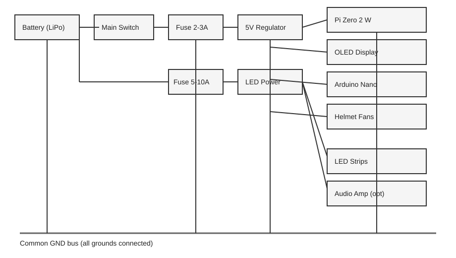
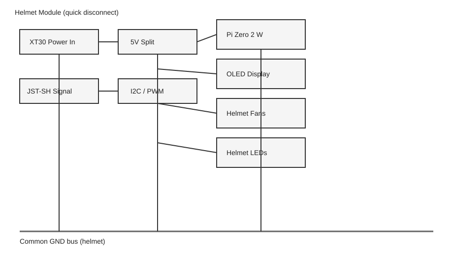
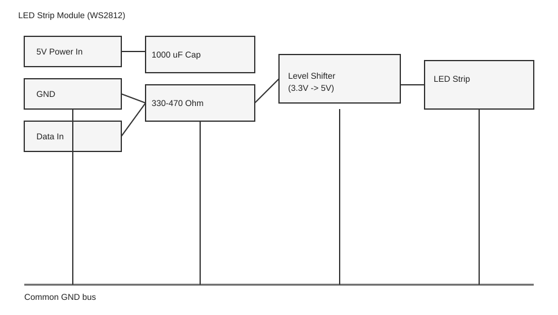

# Elektronik: Verdrahtung und Power-Verteilung

> **Level:** [F] Fortgeschritten | [P] Profi  |  **Varianten:** V2/V3
> **Voraussetzungen:** Strombudget und Batterie gewaehlt (`Documentation/Guides/Elektronik-Strombudget.md`, `Documentation/Guides/Elektronik-Batterie.md`), Loetkolben und Multimeter, Grundlagen Steckverbinder (XT60/XT30/JST).

Ziel: sichere, modulare Verkabelung mit sauberer Trennung von Logik und Leistung.

## Diagramm (SVG)



## Systemarchitektur

```
[Powerbank 1 (10Ah)]                    [PiSugar 3 Plus (5Ah)]
       |                                         |
       | USB 5V/2A                          Pogo-Pins 5V/3A
       |                                         |
  [XT60 Verteiler]                    [Raspberry Pi Zero 2 W]
       |                                    |          |
       +-- XT30 --> [LED Strip +5V]    I2C/SDA     I2C/SCL
       |                (Pin 3)        (Pin 5)
       +-- XT30 --> [Luefter 1+2]          |
       |                              [Arduino Nano]
       +-- JST  --> [Audio Amp]        (I2C Slave 0x08)
                                           |
                                      Pin 5/6 --> LEDs
                                      Pin 9   --> Luefter PWM
                                      Pin 2   --> Taster
```

## Helm-Modul (Detail)



```
Im Helm:
+--------------------------------------------------+
|                                                  |
|  [OLED Display]                                  |
|     |  SDA (GPIO 2)                              |
|     |  SCL (GPIO 3)                              |
|     |  3.3V + GND                                |
|     |                                            |
|  [Pi Zero 2 W] ---- I2C ----> [Arduino Nano]    |
|     |                              |             |
|  [PiSugar 3+]               Pin 6 -> [Visor LEDs (10x WS2812B)]
|  (unter Pi)                  Pin 9 -> [Luefter 1 PWM]
|                              Pin 2 -> [Taster]   |
|                                                  |
|  [Luefter 2] <-- 5V direkt von Stromschiene      |
|                                                  |
+------ Quick-Disconnect (Nacken) ----------------+
        JST-XH 4-Pin: VCC, GND, SDA, SCL
        XT30: +5V, GND
```

## LED-Verkabelung (WS2812B)



### Schaltplan pro LED-Sektion

```
+5V (Stromschiene) ----+---- [1000uF Elko] ---- GND
                        |
                   +5V  |
                    |   |
[Arduino Pin 5] ---[330R]--- DATA IN --> [WS2812B Strip] --> DATA OUT --> naechste Sektion
                                              |
                                         +5V  GND
                                         (von Stromschiene)
```

### Wichtige Regeln

- **330-470 Ohm Widerstand** auf der Datenleitung (direkt am Arduino-Pin, VOR dem ersten LED)
- **1000 uF Elektrolyt-Kondensator** zwischen +5V und GND am LED-Strip-Eingang
- **Level-Shifter** (74AHCT125) wenn Pi direkt LEDs steuert (3.3V -> 5V Logik)
- Bei ueber 30 LEDs: **Power Injection** am Ende des Strips (+5V/GND nochmal einspeisen)
- Datenleitung so kurz wie moeglich halten (max 50 cm zwischen Sektionen)

## Stecker-Uebersicht

| Verbindung | Stecker | Belastbarkeit | Pin-Belegung |
| --- | --- | --- | --- |
| Hauptbatterie | XT60 | 60 A | +5V (rot), GND (schwarz) |
| Modul-Power | XT30 | 30 A | +5V (rot), GND (schwarz) |
| Helm Quick-Disconnect (Power) | XT30 | 30 A | +5V, GND |
| Helm Quick-Disconnect (Signal) | JST-XH 4-Pin | 3 A | Pin1=VCC, Pin2=GND, Pin3=SDA, Pin4=SCL |
| Luefter | JST-XH 2-Pin | 3 A | +5V (rot), GND (schwarz) |
| LED-Sektion (Data + Power) | JST-XH 3-Pin | 3 A | Pin1=+5V, Pin2=GND, Pin3=DATA |
| Audio | JST-XH 2-Pin | 3 A | Signal, GND |
| I2C (Pi <-> Arduino) | JST-XH 4-Pin | 3 A | VCC, GND, SDA, SCL |

## Kabel-Querschnitt

| Leitung | AWG | mm2 | Einsatz |
| --- | --- | --- | --- |
| LED-Power, Hauptversorgung | 18-20 | 0.75-1.0 | Alles was >0.5 A traegt |
| Luefter, Audio, moderate Last | 22-24 | 0.34-0.50 | Einzelkomponenten |
| Signal/Data (I2C, LED-Data) | 26 | 0.14 | NUR Signalleitungen |

## Kabelwege im Suit

```
                    [Helm]
                      |
            Quick-Disconnect (Nacken)
                      |
            +--- Spiralschlauch 6mm ---+
            |                          |
    [Schulter L]            [Schulter R]
         |                       |
    [Oberarm L]            [Oberarm R]
         |                       |
    [Unterarm L]           [Unterarm R]
            |                          |
            +--- Spiralschlauch 6mm ---+
                      |
              [Brust / Ruecken]
                      |
               [Backpack / Guertel]
                (Powerbanks hier)
                      |
            +--- Spiralschlauch 6mm ---+
            |                          |
    [Oberschenkel L]      [Oberschenkel R]
         |                       |
    [Schienbein L]         [Schienbein R]
```

**Alle Kabel in 6 mm Spiralschlauch buendeln und mit Klett-Kabelbindern am Unteranzug fixieren.**

## Sicherheits-Checkliste

- [ ] Sicherungen nahe der Batterie (2-3A Logik, 5-10A LEDs)
- [ ] Keine blanken Kontakte (Schrumpfschlauch, Isolierband)
- [ ] Kabel gegen Zug gesichert (Strain-Relief an jedem Stecker)
- [ ] GND aller Systeme verbunden (gemeinsame Masse!)
- [ ] Not-Aus erreichbar (Hauptschalter oder XT60 Trennstecker)
- [ ] Alle Loetstellen auf Kurzschluss geprueft (Multimeter)
- [ ] Quick-Disconnect am Helm-Nacken funktioniert

## Testreihenfolge

1. **Nur Pi + OLED** - HUD funktioniert?
2. **Pi + OLED + Luefter** - Luftstrom ok?
3. **Arduino + LEDs (auf dem Tisch)** - alle Sektionen?
4. **Audio (falls vorhanden)** - kein Brummen?
5. **Alles zusammen (Tisch)** - Kurzschluss-Check mit Multimeter
6. **Alles in der Ruestung** - Kabel lang genug? Stecker erreichbar?
7. **Bewegungstest** - bleibt alles bei Bewegung verbunden?
