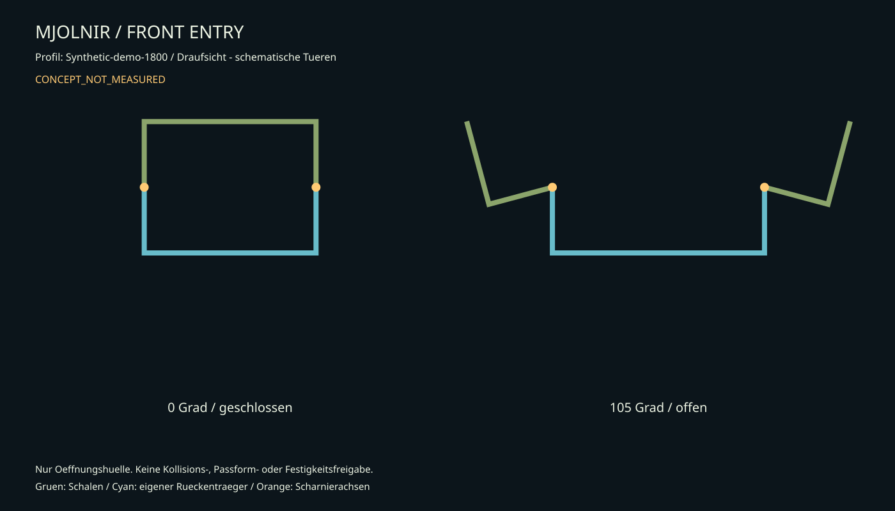

# Mechanischer Einstieg, Verriegelung und Anziehstation

Die Basis ist ein manuell oeffnendes System. Tueren, Gurte und Schalen bleiben
vormontiert. Ziel ist selbststaendiges An- und Ausziehen ohne starre Arm-, Bein-,
Hals- oder Schuhroehren zum Durchschluepfen. Eine Hilfsperson beobachtet die
Entwicklungsproben und kann Lasten uebernehmen; ihre Hilfe ist keine Erfuellung
des spaeteren Solo-Ablaufs. Das Iron-Man-Vorbild wird durch Schalenbewegung und
einen geordneten Einstieg umgesetzt. Die vollstaendige
[Bedien- und Kassettenfolge](Mjolnir-Selbstanziehen.md) beschreibt Gegenhand,
letzte Handschale, offene Gurte und von vorn erreichbare Schulterlaschen.

## 1. Torso: ausfahren und schwenken

T01 ist ein am Hueftgurt sitzender Rueckentraeger. Daran fuehren oben und unten
quer angeordnete Fuehrungen die beiden T02-Seitenfluegel. Jeder Fluegel traegt
eine vordere Tuer an einer vertikalen Scharnierachse. Die verschiebbare
Rueckenabdeckung ueberlappt eine mittlere, feststehende Rueckenleiste.

Geschlossen werden die Seitenfluegel durch von vorn erreichbare, gesicherte
Steck-/Rastbolzen in Position gehalten. Beim Einstieg werden sie nach aussen
geschoben und in einer zweiten, manuell loesbaren Parkposition gehalten. Beide
Positionen erhalten formschluessige Anschlaege. Reine Klemmreibung ist keine
zuverlaessige Positionssicherung. Ein herausziehbarer Bolzen bleibt am Fluegel
gefangen, damit er beim Anziehen nicht verloren geht.

Die Fronttueren schwenken dann nach vorn/aussen. Der Unterbau der Schulterhauben
klappt ebenfalls nach aussen. Schultergurte werden vorne vollstaendig geoeffnet;
kein geschlossener Halsring und keine feste Querstrebe kreuzen die Eintrittsbahn.
Die Seitenfuehrungen duerfen ihre Einrastpunkte erst erreichen, wenn Kleidung
und Polster aus den Fugen entfernt sind.

### Schnittstellen am Torso

| Schnittstelle | Entwurfsregel | Noch zu bestimmen |
| --- | --- | --- |
| Rueckenstege zu Huefttraeger | Mechanisch befestigte Metallkomponenten, grossflaechige Polsterauflage | Querschnitt, Befestigung und Festigkeit nach realer Masse |
| Querfuehrungen | Zwei gefuehrte Ebenen je Fluegel, gegen Verdrehen gesichert | Passende Kauf-Fuehrung oder bearbeitete Fuehrung mit Lastdaten |
| Scharnierachse | Zwei koaxiale Metallgelenke je Fronttuer; Achse seitlich ausserhalb der Schalenfuge | Offset nach Schalen- und Applikationsgeometrie |
| Tuerlagerpunkte | Abstand in Z im Konzept etwa Torsohoehe minus 60 mm | Untergrund, Schraubenbild und Ausreissfestigkeit |
| Tuerhalter offen | Positiver Parkanschlag, von innen/aussen loesbar | Haltemechanismus und gemessene Bedienkraft |
| Frontschliesser | Zwei mechanische Schliesser mit Sekundaersicherung | Modell, Lastdaten, Montageplatten und erreichbare Betaetigung |
| Sternumleiste | Nur an rechter Tuer befestigt, ueberlappt links lose | Schalennaht und Freigang |
| Innenpolster | Austauschbar; nicht in Fuehrung oder Scharnier faltbar | Anpassung am 1:1-Mockup |
| Servicezugriff | Akku-/Sicherungsklappen und Hauptschalter vorne oder vorne/seitlich; unabhaengig von den Fronttueren bedienbar | Griffversuch mit beiden geruesteten Armen und Handschuhen |

Magnete duerfen kosmetische Deckel ausrichten. Sie sind weder einziger
Torso-Verschluss noch Bestandteil einer angenommenen Freigabefunktion.
Gedruckte Lochbild-Coupons dienen der Montageprobe. Lasten aus Tueren und
Rahmen werden nicht ueber ungepruefte Filamentachsen oder Gewindestangen als
Gleitlager gefuehrt.

### Kinematik und Bauraum

Im Modell bewegt sich `open_fraction=0..0.25` zuerst lateral; `0.25..1` schwenkt
die Tueren bis 105 Grad. Das ist eine Darstellungsfolge, keine Motorsteuerung.
Echte Bauteile erhalten manuelle, eindeutige Bedienpunkte.

```text
Eintrittsbreite = max(Schulter, Brust, Bauch, Huefte) + 2 * Handhabungsabstand
Seitlicher Ausfahrweg = max(0, (Eintrittsbreite - geschlossene Innenbreite) / 2)
```

Eigenstaendiges Rechenbeispiel (keine Profilvorgabe): 490 mm Schulterbreite,
30 mm Handhabungsabstand je Seite, 466 mm Torso-Aussenbreite und 3 mm Wand
ergeben 550 mm geforderte Eintrittsbreite und 45 mm Ausfahrweg je Fluegel.
Die Werte des ausgewaehlten Profils stehen im erzeugten Fit-Bericht.
Die stationaeren Rueckenstege duerfen nicht in die lichte Eintrittsbahn hineinragen.



Alle Stellungen muessen auch mit Schulterhauben, Helmrand, Bauchsegmenten,
Gurtverschluessen und Haenden geprueft werden. Der Rechner betrachtet nur die
idealisierte Huelle der Tueren. Er prueft keine Gelenkachsen, keine 3D-Kollisionen
und keine Festigkeit.

### Vorbemessung eines Tuerlagers

Beispiel fuer eine noch zu wiegende Fronttuer: 0,65 kg mit 0,22 m Abstand ihres
Schwerpunkts zur vertikalen Achse. Gewichtskraft `F=m*g=6,38 N`; daraus entsteht
ein Kippmoment an der Lagerung `M=F*r=1,40 Nm`. Das ist **kein** erforderliches
Antriebsdrehmoment um die vertikale Achse. Bei zwei Lagern im Abstand 0,28 m
entsteht aus diesem Moment ein zusaetzliches Kraeftepaar von etwa 5,0 N; dazu
kommen Gewichtslast, Schraeglage, Handhabung und dynamische Einfluesse.
Lagerdaten, Plattenbiegung, Schrauben und Schalenanschluss muessen gemeinsam
bemessen werden. Eine beliebige Multiplikation mit einem Sicherheitsfaktor
ersetzt diesen Nachweis nicht. Bis dahin: Tuer nur als Tisch-/Kartonprototyp.

## 2. Arme, Beine, Helm

| Baugruppe | Mechanismus | Bedienung |
| --- | --- | --- |
| Schulter | Schwimmende Textilaufnahme; separate Klappaufnahme fuer Parkstellung | Seitlich hochklappen; vordere Zuglasche zum Schliessen, kein letzter Verschluss hinten |
| Ober-/Unterarm | Jede Schale als eigene Clamshell; Scharnier aussen, Schliesser erreichbar vorne/innen | Arm hineinlegen, nicht die Hand durch ein enges Rohr zwingen |
| Oberschenkel | Geteilte Schale an breitem Textilaufhaenger | Front aufklappen, seitliche Exoskelett-Manschette frei halten |
| Knie | Leichtes Pad an textilem Zwischenstueck | Verschiebt sich relativ zu beiden Schalen; keine Zwangsfuehrung |
| Schienbein | Geteilte Schale; Entlastung zum Knoechel | Front oeffnet, Fuss bleibt im normalen Schuh |
| Handruecken | Leichte dauerhaft am Handschuh sitzende oder seitlich aufklappende Platte | Zweiter Arm muss mit der schon geruesteten Gegenhand bedienbar bleiben |
| Schuhcover | Geteilter Fersen-/Spannbereich; keine geschlossene Ruestungsschlaufe unter der Sohle | Cover um den beschuhten Fuss schliessen; von vorne/seitlich wieder oeffnen |
| Helm | Abnehmbarer Helm; separat manuell zu oeffnender Visor/Heckverschluss, offene Halsabdeckung | Ganzer Helm ohne Elektrik abnehmbar; keine enge starre Halsdurchfuehrung |

Die kosmetischen Beinverbindungen haben keinen Bodenkontakt und sind keine
Bein-Exoskelett-Tragglieder. Ellbogen, Schulter und Knie folgen keiner
einachsigen Scharnierlinie am Koerper. Fuer Transport und Wartung lassen sich
Kassetten ueber beschriftete Schnellverbindungen abnehmen; das ist nicht bei
jedem Anziehen notwendig.

Auch alle Innengurte muessen auf der Verschlussseite vollstaendig oeffnen und
mit gefangenen Enden offen parken. Ein geschlossener Haltering hinter einer
offenen Aussenschale wuerde den Zweck verfehlen. Elektrische Leitungen bleiben
auf der hinteren Auflage oder werden am Scharnier geschuetzt gefuehrt; sie
duerfen die freie Eintrittsfuge nicht ueberbruecken. Die vier
[beweglichen Clamshell-Bauraumtypen](../../Design/Clamshell/README.md) bilden
beide Seiten unabhaengig ab, enthalten aber keine fertigen Kaufgelenke.

## 3. Anziehstation D01

Die Station traegt ausschliesslich **ungetragene Ruestung**, keine Person.
Gepolsterte offene Ablagen halten Rueckentraeger, Arm- und Beinkassetten in
einstellbarer Hoehe. Keine geschlossenen Fussaufnahmen oder Bodenbuegel im
Einstiegsweg. Der Traeger muss frei nach vorn aus dem System treten koennen.

Das CAD zeigt nur eine beispielhafte 900 x 800 mm Basis mit Rueckenmast.
Vor Fertigung werden reale Schwerpunkte aller offenen Tueren, eine moegliche
Handhabungskraft und die Kippkante in jeder Richtung gerechnet. Die Projektion
des belasteten Schwerpunkts allein reicht nicht als Nachweis gegen Anstossen.
Fussabdruck oder Befestigung an einer geeigneten Werkstattstruktur werden
danach festgelegt. Keine ungebremsten Rollen; zum Anlegen nivelliert und gegen
Verschieben gesichert. Keine Sackgasse zwischen Station und Wand.

Station und Exoskelett duerfen nicht ueber ihre Gurtaufnahmen miteinander
verschraubt werden. Ein aktives Seriengeraet wird ausserhalb der Station nach
Herstelleranleitung angelegt; die offen gehaltenen Ruestungskassetten werden
anschliessend darum geschlossen.

## 4. Normales Anziehen

1. Ruestung stromlos; Station standsicher; alle Kassetten offen und gehalten.
2. Unteranzug, normale Schuhe, optional passendes Serien-Exoskelett separat anlegen.
3. Sitzend Schuhcover und Unterschenkelschalen um Fuss/Bein schliessen; keine
   starre Roehre durchqueren. Ruecken an T01 positionieren; Oberschenkel offen.
4. Eigenen Hueftgurt und stabilisierende Schultergurte schliessen; nicht mit dem
   Gurt des Serien-Exoskeletts verwechseln.
5. Oberschenkelschalen vorne/innen schliessen und Knie-/Hueftfreiheit pruefen.
   Fronttueren schliessen und Seitenfuehrungen kontrolliert in Tragstellung
   bringen. Gurt-/Kabel-/Polsterfreiheit dabei pruefen.
6. Textile Handschuhe anziehen, Arme in offene Kassetten legen; weniger geschickten
   Arm zuerst schliessen. Zweiten Arm mit bereits geruesteter Gegenhand schliessen,
   danach Schulterhauben ueber vordere Laschen absenken und sichern.
7. Frontschliesser und Sekundaersicherungen von Hand pruefen; Stationsablagen
   vollstaendig freigeben. Vor erstem Schritt eine Sichtkontrolle rundum.
8. Stand-/Schrittprobe ohne Helm; Helm zuletzt; Lueftung, Licht und Audio zuschalten.

Zielzustand: keine Schraube, kein loser Achsstift, kein Durchschluepfen durch
starre Ruestung und kein Werkzeug im Ablauf. Hauptschalter, Akku-Servicezugriff
und Entriegelungen werden mit komplett geruesteten Armen erneut erreicht.
Die Zeitvorgabe ist ein Entwicklungsziel. Solange ein Schritt Handmontage
einzelner Platten verlangt, wird die entsprechende Kassette ueberarbeitet.

## 5. Notausstieg als eigenstaendiger mechanischer Weg

Frontverschluesse, Gurtverschluesse und Kassettenverschluesse erhalten erreichbare,
unverwechselbare Laschen. Jede Lasche loest nur ihre definierte Funktion.
Eine einzige komplexe Bowdenzugkette als alleiniger Ausstieg wird vermieden:
ein blockierter Zug darf nicht den gesamten Anzug geschlossen halten.

1. Helm/Visor manuell freigeben, Sicht und Atmung herstellen.
2. Beide Frontschliesser oeffnen, Tueren freigeben; falls eine Tuer blockiert,
   deren separate, werkzeuglose Scharnier-/Kassetten-Trennstelle benutzen.
3. Arme und eigenen Traegergurt freigeben. Hilfsperson kontrolliert die Last;
   kein unkontrolliertes Abwerfen schwerer Rueckenteile auf Fuesse.
4. Bein- und Schuhcover oeffnen. Serien-Exoskelett nach eigener Herstellerfolge
   ablegen, unabhaengig von Elektronik und Ruestungssteuerung.

Kein Hauptlastbolzen darf unter Koerpergewicht gezogen werden muessen. Ein
klemmendes Scharnier ist als Versagensfall einzuplanen. Sitzend, stromlos und
mit Handschuhen testen. Ziel <=60 Sekunden fuer die gesamte Befreiung bleibt
offen, bis drei dokumentierte Proben bestanden sind.

## 6. Was als Naechstes gefertigt wird

Ein kompletter **Torso-Mockup** aus Karton/leichter Platte mit echten Handgriffen,
zwei Fuehrungsattrappen, Scharnieren, Sternumleiste und Schulterkonturen. Noch
keine Vollruestung. Sobald Eintritt, Sitzen, Tueroeffnung und mechanische
Befreiung funktionieren, folgt ein einzelnes, leichtes Tuerlager auf dem Tisch.
Die weitere Reihenfolge steht im [Prototypenplan](../../BuildGuides/Armor/Mjolnir-Prototypen.md).
