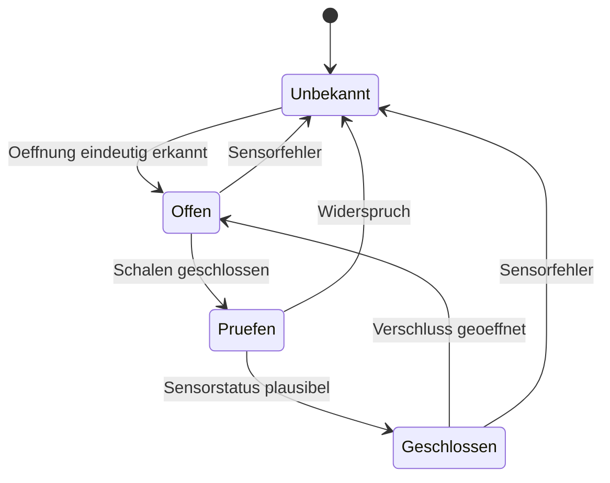

# Einstiegselektronik und optionale Show-Aktorik

## Grundausstattung: mechanische Tueren, elektrische Anzeige

Das Anziehen, Verriegeln und Oeffnen funktioniert ohne Akku. Ein Controller kann
Frontschliesser und Parkpositionen anzeigen, darf aber keinen Verschluss
festhalten. Ein gruener Sensorstatus ersetzt nie die manuelle Verschlussprobe.
Die bestehenden HUD-/LED-Beispiele bleiben Beispiele; sie sind keine
sicherheitsgerichtete Maschinensteuerung.

| Versorgung | Verbraucher | Einbau |
| --- | --- | --- |
| 5 V Komfort | Luefter und optionale einfache Statusanzeige | Eigene Absicherung und erreichbarer Schalter |
| 5 V Effekte | Ruestungs-/Helm-LEDs, Audio nach gewaehltem Modul | Getrennt vom Komfortzweig |
| Rechner/Display optional | Vorhandenes HUD | Eigene Versorgung nach konkreter Hardware |
| Serien-Exoskelett | Herstellergeraet | Ausschliesslich dessen Originalsystem |

Sicherungswert, Leitung und Steckverbinder werden zusammen nach realer
Stromaufnahme, Einschaltspitze, Leitungslaenge, Temperatur und Herstellerdaten
ausgelegt. Ein pauschaler 5-10-A-Sicherungswert schuetzt nicht automatisch
duenne Sensorkabel. Sicherungen nah an der Energiequelle; keine ungeschuetzte
Leitung durch ein Scharnier oder zwischen die Schalenhaelften fuehren.

Der mechanische Ausstieg liegt vor der Notwendigkeit, einen elektrischen
Stecker zu trennen. Kabel haben Zugentlastung auf beiden Seiten und eine
werkzeuglos erreichbare Trennstelle; keine Hals-/Handgelenkschlaufe.

## Zustandsanzeige ohne Motorsteuerung

Die Anzeige meldet ausschliesslich das Sensorsignal, nicht die mechanische
Tragfaehigkeit oder eine Gehfreigabe. Mechanische End-/Verschlusssensoren mit
Leitungsbrucherkennung sind fuer eine spaetere Anzeige zweckmaessig; konkrete
Sensoren und deren Verdrahtung werden erst nach der Verschlussauswahl festgelegt.

## Motorischer Iron-Man-Effekt als zweite Entwicklung

Der beschriebene mechanische Einstieg ist ohne Motorik ausgelegt. Fuer
einen zusaetzlichen Show-Effekt kommen zuerst **leichte Dekorpanels auf einem
ungetragenen Tischmodell** infrage. Eine betriebsfertige koerpernahe Aktorik ist
mit unbekannten Panelmassen und Kinematik nicht auslegbar.

Fuer jeden zukuenftigen Aktor sind zu erfassen:

| Eingabe | Bedeutung |
| --- | --- |
| Bewegte Masse inkl. Halter | Belastung entlang des gesamten Weges |
| Schwerpunkt und Gelenkachsen | Gravitationsmoment in jeder Pose |
| Aktor-Anlenkpunkte | Hebelarm; Totpunkte und kleine Hebelarme vermeiden |
| Reibung und Anschlaege | Tatsaechliche Last, nicht nur statische Geometrie |
| Weg/Geschwindigkeit | Energie und Reaktionsraum |
| Blockierfall | Messbarer Kraftanstieg und mechanische Trennung |
| Verlust der Versorgung | Panel bleibt handloesbar; kein Zwang auf den Koerper |

Fuer eine horizontale Klappenachse lautet der statische Beitrag beispielhaft
`M = m*g*r*sin(alpha)` mit Winkeldefinition zur senkrechten Schwerpunktlage.
Eine Linearaktuator-Kraft ergibt sich aus `F = M / senkrechtem_Hebelarm`; nahe
einem Totpunkt kann der Hebelarm gegen null gehen. Deshalb wird kein Motor
allein nach einer beworbenen kg-cm-Angabe ausgewaehlt.

Vor einer spaeteren koerpernahen Erprobung sind mechanische Kraftbegrenzung,
zugaengliche Entkopplung, Totmannbedienung, hardwareseitige Abschaltung,
Endlagen-/Blockiererkennung und ein dokumentierter Test des Ausfallverhaltens
am ungetragenen Aufbau notwendig. Strommessung und Software allein sind keine
Quetschschutzfunktion. Ein Neustart darf keine Bewegung beginnen.

Es wird keine Arduino-Datei mit erfundenen Servowinkeln oder ungeprueften
Grenzstroemen als fertige Anzugsteuerung beigelegt. Vorhandene LED-/HUD-
Funktionen werden durch diese Arbeit nicht mit Antrieben gekoppelt.
Die zu entwickelnde Aktorik bleibt im [Prototypenplan](../../BuildGuides/Armor/Mjolnir-Prototypen.md)
als eigener offener Meilenstein dokumentiert.
