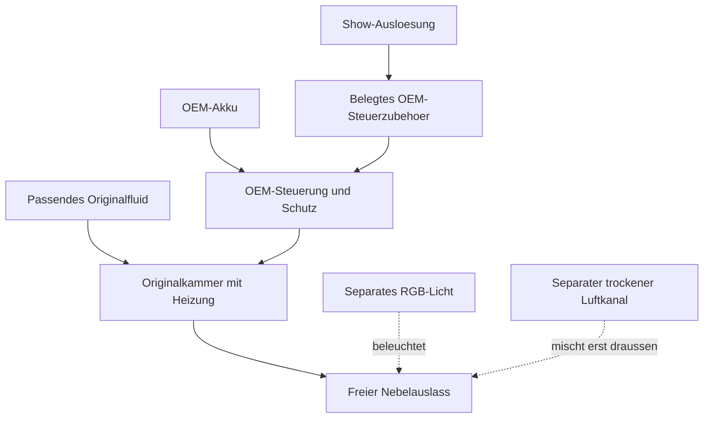

# Nebeltechnik: PMI-Arbeitsbasis und gezielte Verbesserungen

Stand: 2026-09-10. Technischer Vergleich und Integrationsentwurf; keine
gebaute Nebelmaschine. Das Projekt verwendet ein OEM-Nebelgeraet. Die vorhandene
CAD-Lichtblende ist eine trockene Aussenbaugruppe; die interne PMI-Kammer,
Heizung, Firmware und deren elektrische Schaltung wurden nicht nachkonstruiert.

## 1. Welches technische Prinzip gemeint ist

PMI beschreibt ein Heizelement innerhalb der austauschbaren Fluidkammer sowie
eine Abschaltung bei unzureichender Fluidversorgung. Cloud Formula verwendet nach
Herstellerangabe pflanzliches Glycerin und Propylenglykol ohne zugesetztes Wasser.
Der aktuelle PRO-V2-Lieferumfang nennt Chamber V3.0 mit AERO-Mesh-Design.
Das sind Herstellerangaben; Mesh-Geometrie, Heizwiderstand, Temperaturregelung
und Rezepturanteile sind in den geprueften Unterlagen nicht offengelegt.
[Fluid und Heizung](https://pmigear.com/pages/troubleshoot),
[PRO V2 und Kammerrevision](https://pmigear.com/products/pmi-smokeninja-pro-v2).

Die physikalische Einordnung ist ein thermisch erzeugtes Aerosol: Nach der
Erhitzung bildet sich der sichtbare Nebel im austretenden und abkuehlenden
Gemisch. Das Wort AERO-Mesh belegt keinen kalten Ultraschallzerstaeuber.
Es werden keine Verbrennung, Pyrotechnik oder echter Schub benoetigt. Der
Modusname Dry Ice bezeichnet einen Look; daraus folgt kein CO2-/Trockeneisgeraet.
Ein Wasser-Ultraschallmodul ist ein anderer Bauweg und kein Ersatz fuer die
PMI-Kammer mit demselben Fluid.

Funktionsdarstellung fuer die Integration, kein interner PMI-Stromlaufplan:

## 2. Datenstand und technische Grenzen

| Bereich | Belegt | Konsequenz fuer die Auslegung |
| --- | --- | --- |
| Betriebszeit | PMI nennt fuer PRO bis zu 3 Minuten je Burst in Fog/Steam/Haze; Abkuehlung wird angezeigt | Keine Dauerbetriebsfreigabe und kein erlaubter Wiederholungszyklus der Ruestung |
| Bauform | Die PRO-Vergleichsseite nennt 162 x 61 x 36 mm und 280 g mit Kammer/Akku | Referenzwert; Schutzhuelle, Fuellung, Kabel und konkrete V2-Revision am Kaufteil erfassen |
| Akku | Hersteller fordert fuer NINJA/PRO eine passende 18650-Zelle; Laden ueber USB-C | Originalversorgung beibehalten; Ladeleistung nicht als Heizleistung einsetzen |
| Laufzeitangaben | FAQ nennt rund 18 Minuten Gesamtausgabe, PRO-Vergleich rund 20 Minuten Akkuzeit | Bedingungen/Revisionen sind nicht identisch dokumentiert; keine garantierte Impulszahl daraus ableiten |
| Fluidbedarf | FAQ: Fog/Haze etwa 0,5 ml/min, Steam etwa 0,05 ml/min | Nur Hersteller-Referenzwerte; Gewichtsdifferenz einer realen Impulsserie messen |
| Waerme/Lage | Unterversorgung der Heizung kann TIME OUT ausloesen; abwaerts gerichteter Betrieb ist zeitlich begrenzt | Kammerlage, Temperatur und Nachspeisung am konkreten Rueckenmodul pruefen |

Quellen: [PRO-Vergleich](https://pmigear.com/pages/smoke-ninja-pro),
[Betriebs-FAQ](https://pmigear.com/pages/troubleshoot),
[Akkuvorgaben](https://pmigear.com/pages/battery-guide).
Es fehlen weiterhin belastbare Werte fuer internen Heizstrom, Regeltemperatur,
zulaessigen Gegendruck und den tatsaechlichen Nebelvolumenstrom dieser
Schlauchkonfiguration. Raumflaechen aus der Werbung sind kein Duesen-Durchsatz.

Das inzwischen abgerufene [PRO-Handbuch, September 2024](https://cdn.shopify.com/s/files/1/0570/3440/8128/files/SmokeNINJA_PRO_Text_Manual-compressed.pdf?v=1729673832)
wurde im englischen Teil auf PDF-Seiten 3-9 geprueft. Es nennt 9 ml Kammerinhalt,
15 Minuten Gesamtausgabe im maximalen Fog-Modus und 0,1 ml/min fuer Steam.
Diese Werte weichen teilweise von der aktuellen FAQ ab. USB-C wird dort nur
als Ladeanschluss beschrieben; ein Trigger-Pinout fehlt.

**Offene Revisionsfrage fuer die Trageintegration:** PDF-Seite 8 nennt wegen
heissen Aerosols/Tropfen 3 m Abstand zur Duese und 50 cm zu brennbaren oder
waermeempfindlichen Materialien. Die aktuelle
[Smoke-Vest-Seite](https://pmigear.com/products/pmi-smoke-vest-on-body-smoke-system)
bewirbt dagegen einen geschuetzten Aufbau am Koerper. Fuer den Einbau ist deshalb
eine passende aktuelle Anleitung fuer Geraet, Kammer, Vest und Schlauchweg
erforderlich. Die aeltere Anleitung liefert keine pauschale Freigabe der
koerpernahen Sonderkonstruktion. Ein Verlaengerungsschlauch beweist nicht, dass
diese Abstaende entfallen.

## 3. Sinnvolle Verbesserung innerhalb des PMI-Systems

Die interessanteste mechanische Option ist das originale
[Chamber Extension Cable](https://pmigear.com/products/pmi-chamber-extension-cable):
PMI beschreibt eine entfernt betriebene Kammer, 60 cm Kabellaenge und bis zu
drei verbundene Kabel mit 1,8 m Gesamtlaenge. Die Produktseite liefert keine
vollstaendige Kompatibilitaetsmatrix fuer alle PRO-V2-, Kammer- und Fluidrevisionen.
Diese konkrete Kombination bleibt vor Beschaffung zu bestaetigen.

**Eigener Konstruktionsvorschlag:** Hauptgeraet und Akku bleiben in einem
zugaenglichen Fach am tragenden Ruecken-/Hueftsystem. Die Kammer sitzt in einer
separaten geschuetzten Serviceaufnahme naeher am Auslass. Der kurze verbleibende
Nebelweg kann Transportverzoegerung und Kondensation verringern. Er beseitigt
weder die Reaktionszeit der Kammer noch ihr Restnebeln nach dem Stoppen.

Die warme Kammer braucht eine eigene mechanische Aufnahme mit Beruehrungsschutz,
Belueftung, geeigneter thermischer Trennung und Servicezugang. Die bestehende
[140-mm-Lichtblende](../../Design/HardwareKit/README.md) ist dafuer kein
fertiger Kammerhalter. Das Kabel ist ein Original-Leistungs-/Kammerzubehoer;
es wird nicht durch ein gewoehnliches USB-Kabel oder einen Eigenbau ersetzt.

Fuer zwei sichtbare Duesen bestehen zwei Entwurfsvarianten:

- **Eine Quelle, zwei kurze Nebelwege:** weniger Masse und Kosten; Teilung,
  Gleichmaessigkeit und Nachnebeln bleiben abhaengig von der Schlauchgeometrie.
- **Zwei vollstaendige OEM-Quellen:** je eine Kammer pro Duese ermoeglicht
  unabhaengige Effekte. Akku-, Geraete-, Fluid- und Waermebedarf steigen.
  Gleichzeitigkeit muss trotz gemeinsamer Ausloesung gemessen werden.

Zwei Kammern an einer einzelnen Maschine werden nicht als unterstuetzt
angenommen. Das Verlaengerungskabel ist kein elektrischer Y-Verteiler.
Die Basis-BOM bleibt bei einer Quelle; die zweite Variante ist ein Ausbauplan.

## 4. Synchronisation: jetzt konkret belegbar, noch nicht implementiert

PMI bestaetigt fuer SmokeNINJA PRO V2 Steuerung ueber Funk und USB-C,
einen optionalen Kabeltaster sowie DMX mit Zusatzmodul. Damit ist ein
OEM-Steuerweg belegt. Ein offenes USB-Protokoll, GPIO-Pinout oder eine
auslesbare Bereitschaftstelemetrie wurde dadurch nicht nachgewiesen.
[Hersteller: Steueroptionen](https://pmigear.com/products/pmi-smokeninja-pro-v2),
[Steuerzubehoer](https://pmigear.com/pages/smoke-accessories).

Ausbaureihenfolge fuer das Projekt:

1. Originaltaster/Fernbedienung am Tisch mit genau dokumentiertem Modus pruefen.
2. Fuer gemeinsamen Start einen passenden OEM-Kabeltaster oder OEM-DMX-Adapter
   mit dessen Anleitung beschaffen; Pinout bzw. DMX-Belegung und Stopverhalten
   festhalten. USB-C ist hier eine Steckerform, keine Erlaubnis fuer eigene
   Spannung oder ein geratenes serielles Kommando.
3. Erst dann Show-Steuerung anbinden. Licht, Sound und Nebel erhalten getrennte
   Ausgaenge. Maximale Effektzeit wird auf den erprobten kurzen Fotoimpuls
   begrenzt; ein gehaltenes Startsignal darf keine neue Folge ausloesen.
4. Abbruch, Neustart, abgezogenes Kabel und verlorene Steuerdaten pruefen.
   Ein erfolgreicher Sendebefehl ist keine Bestaetigung fuer austretenden Nebel.
   Fehlt eine Rueckmeldung, zeigt das HUD nur den gesendeten Showbefehl.

Die Originalbedienung bleibt der vorgesehene Ausloeseweg. Eine eigene
elektrische Nebelansteuerung ist im Projekt noch nicht implementiert.
Die unabhaengige Komfortlueftung bleibt
beim normalen Show-Abbruch eingeschaltet.

## 5. Alternativen nach technischem Ziel

| Ziel / Kandidat | Belegter Unterschied | Einordnung fuer das Projekt |
| --- | --- | --- |
| Kompakter geregelter Aufbau: PMI PRO V2 | OEM-Tragesystem, Kammer-/Fluidzubehoer und Steueroptionen | Bestehende Arbeitsbasis; zuerst Transportweg und Licht optimieren |
| Eigene Steuerintegration: Vosentech MicroFogger 5 Pro | Offizielles Steuerkabel/Breakout fuer Taster, Relais oder 3-5-V-Logik; getrennte Dichte-/Luftstufen | Interessante Alternative, wenn dokumentierte elektrische Ansteuerung Vorrang hat; 5 Lite ist nicht kabelkompatibel |
| Kleiner abgesetzter Kopf: Look Solutions Tiny FX | 70-W-Verdampfer, 180-g-Kopf, separater 200-g-Akku, 5-ml-Tank; fuer Kostueme beschrieben | Akkugewicht kann anders verteilt werden; kleiner Tank erfordert haeufigeres Nachfuellen |
| Schneller verschwindender Look: PMI Vanishing Kit | Eigene Kammer, Fluid und Amplifier Nozzle; fuer PRO angeboten | Foto-Alternative nach Bestaetigung der Schlauch-/Vest-Kombination; nicht als universelle Austauschfuellung behandeln |

Primaerquellen:
[MicroFogger 5 Pro](https://vosentech.com/index.php/product/microfogger-5-pro/),
[Steuerkabel](https://vosentech.com/index.php/product/microfogger-control-cable/),
[MicroFogger-Handbuch 1.2](https://vosentech.com/wp-content/uploads/2023/08/MF-V5-P-manual-1.2.pdf),
[Tiny FX](https://looksolutions.com/produkte/tiny_fx/2.html),
[Vanishing Kit](https://pmigear.com/products/pmi-vanishing-formula-kit).

MicroFogger empfiehlt bei hoher Leistung etwa 10 Sekunden und anschliessend
Pause; die Tankzone kann laut Produkt-FAQ bei laengerer Volllast etwa 90 Grad C
erreichen. Lage und Fuellstand begrenzen den Einsatz. Er ist deshalb kein
pauschal thermisch besserer Nebler. Das Vosentech-Steuerkabel ist keine
allgemeine USB-Daten-API. Fremdgeraete werden nicht in die nur fuer PMI
vorgesehene Smoke Vest eingesetzt.

PMIs Haze Nozzle verteilt den Nebel gezielt als Raumhaze. Fuer zwei klar
erkennbare Halo-Duesen ist mehr Verteilung nicht automatisch besser.
Die kleinen trockenen Effektluefter bleiben separat einstellbar; ihre Wirkung
wird auf den Fotomoment abgestimmt. Vanishing-Marketing zu Rauchmeldern ist
keine Freigabe fuer eine Veranstaltung. Der Ort und reale Effektbetrieb bleiben
Teil der vorhandenen Messeabstimmung.

## 6. Woran besser tatsaechlich gemessen wird

Jede Variante bekommt dieselbe Beleuchtung, Kameraeinstellung, Ausrichtung,
Referenzimpulslaenge und dokumentierte Raumluftbedingungen. Eine kurze
Zeitlupenaufnahme kann Start-/Stoppzeit und Links-rechts-Versatz vergleichen.

| Kriterium | Zu erfassender Wert | Verbesserung bedeutet |
| --- | --- | --- |
| Reaktion | Zeit von Ausloesung bis erstem sichtbarem Nebel je Auslass | Weniger und gleichmaessigere Verzoegerung |
| Nachnebeln | Zeit bis zum Ende des sichtbaren Austritts nach Stop | Definierteres Ende des Fotoeffekts |
| Sichtbarer Strahl | Vergleichbare Bildausschnitte bei gleicher Belichtung | Deutliche Kontur ohne Ueberstrahlung oder starke Verduennung |
| Verbrauch | Fluidmasse und verbrauchte Energie je Impulsserie | Gleiche Bildwirkung bei geringerem Verbrauch |
| Waerme | Kammer, Auslass, Huelle und koerperseitige Flaeche | Einhaltung der festgelegten Geraete-/Materialgrenzen |
| Kondensat | Ort und Menge nach derselben Betriebsserie | Weniger Ablagerung und kein Fluidaustrag in Elektronik/Hautwege |
| Solo-Bedienung | Stopzugang, Leitungsfreiheit und Servicezeit | Schneller Zugriff ohne Blockade der Ruestungsoeffnung |

Messfelder und fehlende OEM-Daten stehen im
[Integrationsregister](../../Design/Fog/IntegrationSpec.json). Es ist eine
Planungsdatei, keine neue Firmware-/Profilkonfiguration. Alle Realpruefungen
bleiben im [Nebel-Pruefprotokoll](../../Tests/TestReports/Mjolnir-Nebel-Abnahme.md)
offen, bis Messbelege vorhanden sind. Ein staerkerer Nebelstrahl allein
belegt keine bessere Gesamtloesung.
