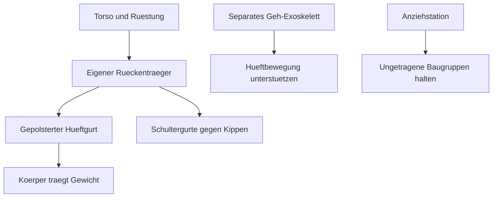

# MJOLNIR fuer Huskynarr: Systementwurf V4

**Arbeitsstand: ausformulierter Entwicklungsentwurf mit parametrischem
Bauraummodell. Physischer Prototyp und persoenliche Passform noch nicht geprueft.**

Die Zielrichtung ist ein Master-Chief-inspiriertes Halo-Infinite-Cosplay mit
mechanisch oeffnenden, vormontierten Baugruppen und einem separat passenden
Exoskelett. Das bisherige Projektziel Mark VI GEN3 / Mark VII bleibt die
gestalterische Referenz; als Ausgangspunkt wird **Mark VI GEN3** verwendet.
Die beiliegenden Mark-VII-PDFs sind Vergleichsmaterial, keine Mark-VI-Massvorlage.

## 1. Was jetzt feststeht

| Vorgabe | Umsetzung | Nachweisstand |
| --- | --- | --- |
| 1,66 m Koerpergroesse | 1660 mm im versionierten Profil | Aus aktueller Angabe |
| Breite Schultern | Schulterbreite unabhaengig von Torsohoehe; ausfahrbare Seitenfluegel | Qualitative Angabe, Breite noch messen |
| Huskynarr auf Instagram | Profil als Stilreferenz verlinkt | Keine kalibrierten Ansichten auswertbar |
| Exoskelett wie bekannte chinesische Systeme | Hypershell X Series (S) und DNSYS X1 als reale Integrationskandidaten | Keine persoenliche Kompatibilitaet bestaetigt |
| Oeffnen wie bei mechanischen Iron-Man-Cosplays | Fronttueren, seitlich ausfahrende Fluegel, aufklappbare Gliedmassenschalen | CAD-Bewegungsentwurf vorhanden |
| Weniger Zusammenbau beim Anziehen | Vormontierte Baugruppen in einer Anziehstation | Ablauf entworfen, Zeitmessung offen |

Eine Angabe wie 1,66 m erlaubt **keine** verlaessliche Ableitung von Brusttiefe,
Halsweite, Oberschenkelumfang oder Gelenkpositionen. Die 31 fehlenden linearen
Masse bleiben im echten Profil `null`. Nur die mit `--concept` erzeugte Ansicht
verwendet synthetische Beispielwerte mit Herkunftskennzeichnung.

## 2. Die Silhouette

Kurzer, segmentierter Torso und breite, seitlich schwebende Schulterplatten;
keine kuenstliche Verlaengerung von Schienbeinen oder starre Plattformstelzen im
Grundaufbau. Brusthoehe, Brustbreite und Brusttiefe werden einzeln angepasst.
Die Schulterplatten erhalten nur einen einstellbaren optischen Ueberstand,
statt breite Schultern in eine fuer grosse, schmale Personen skalierte Ruestung
zu zwingen. Der Bauchbereich folgt seinem tatsaechlichen Maximalquerschnitt,
auch beim Sitzen. Drei ueberlappende Bauchsegmente und eine hochklappbare
Guertelschuerze verdecken Bewegungsfugen, ohne Taille oder Leisten einzuklemmen.

Optik: olivgruene facettierte Schalen, goldener Visor, dunkler flexibler Unterbau,
wenige cyanfarbene Statuslichter. Die Mechanik bleibt unter seitlichen und
rueckwaertigen Abdeckungen. Eine schmale Sternumleiste verdeckt die Frontnaht;
sie ist nur an **einer** Tuer befestigt. Keine starre Bruecke ueber die Oeffnung.

Das CAD zeigt die technischen Huellen. Die finalen Mark-VI-Panzerkonturen werden
nach der Passprobe an ein rechtmaessig beschafftes Oberflaechenmodell angepasst.
Das Repository enthaelt weiterhin kein fertiges, individuell passendes Halo-STL-Set.

## 3. Vier voneinander getrennte Funktionen

| Ebene | Aufgabe | Physische Kopplung |
| --- | --- | --- |
| Unteranzug + gepolsterter Traeger | Kontakt, Lastverteilung, Komfort | Textile Gurte und Hersteller-Trageschnittstellen |
| Eigener Ruestungsrahmen | Torso und leichte Anbauteile halten | Rueckenstege, Hueftauflage, kippsichernde Schultergurte |
| Geh-Exoskelett | Optional aktiv Hueftbewegung unterstuetzen | Originalgurt und Original-Beinmanschetten des Geraets |
| Ruestungsschalen + Einstieg | Halo-Optik und reproduzierbares Anlegen | Scharniere, Fuehrungen, formschluessige Handverschluesse |

Der eigene Rahmen verteilt Ruestungslast auf den Koerper. Er leitet sie **nicht
am Koerper vorbei in den Boden**. Dazu waeren Fussplatten, lasttragende
Beinstrukturen und nachgewiesene Gelenkkinematik notwendig. Diese Funktion wird
weder einem Wander-Exoskelett noch dem CAD zugesprochen.

## 4. Baugruppen statt loser Einzelplatten

| ID | Einheit | Bleibt vormontiert | Oeffnung / Trennung |
| --- | --- | --- | --- |
| T01 | Traeger + Ruecken | Rueckenstege, Gurtaufnahme, Elektronikpod | Zwei von vorn erreichbare Gurtverschluesse |
| T02-L/R | Thorax-Seitenfluegel | Seitenfuehrung, Fronttuer, Scharnier, Schliesser | Seitlich ausfahren, dann nach vorn aussen schwenken |
| S01-L/R | Schulterkassetten | Schulterhaube auf schwimmender Textilaufnahme | Nach aussen hochklappen, manuelle Parkposition |
| A01-L/R | Armkassetten | Ober-/Unterarm getrennt beweglich, Handplatte am Handschuh | Vordere Haelften aufklappen; textile Verbindung abwerfbar |
| H01 | Guertelschuerze | Bauchlamellen und Frontabdeckung | Hochklappen; separates Oeffnen fuer Sitzen/Toilette |
| L01-L/R | Beinkassetten | Oberschenkel, schwimmendes Kniepad, Schienbein | Schalen oeffnen einzeln; Verbindung flexibel statt Kniegelenk |
| F01-L/R | Schuhcover | Am jeweiligen normalen Schuh | Spann-/Fersenriemen erreichbar; keine Hoehenerhoehung |
| E01 | Servicepod | Akku, Sicherungen, Luefterverteiler | Seitliche Klappe unabhaengig vom Einstieg |
| D01 | Anziehstation | Einstellbare Halter fuer Torso und Kassetten | Werkzeuglose Ablage; vor dem Gehen komplett entkoppeln |

Die Textilverbindungen positionieren Teile beim Anziehen. Sie sind im Betrieb
locker genug fuer reale Gelenkbewegung und loesen fuer den Notausstieg einzeln.
Ein verbundenes Arm-/Beinpaket bedeutet keine starre Kette ueber mehrere Gelenke.

## 5. Oeffnung und Reihenfolge

T02 hat zwei Bewegungen: Seitenfuehrungen vergroessern zuerst die Eintrittsbreite;
danach schwenken die Tueren bis zur einstellbaren Parkposition nach aussen.
Das Modell zeigt 105 Grad als Entwicklungswert. Die konkrete Scharnierachse
muss nach Schalenstaerke, Brustapplikation und Armfreiheit positioniert werden.

Die freie Eintrittsbreite soll die groesste gemessene Schulter-/Torso-/Hueftbreite
plus beidseitigen Handhabungsabstand abdecken. Der Generator berechnet daraus
den erforderlichen seitlichen Verstellweg. Ein 1:1-Mockup prueft diese Absicht,
einschliesslich vorstehender Schnallen, Polster und Kleidung.

Der Ablauf und die mechanischen Schnittstellen stehen in
[Einstieg und Verriegelung](Mjolnir-Einstieg.md). Das Anziehziel nach Anpassung
ist hoechstens fuenf Minuten mit einer Hilfsperson; es ist **kein gemessener Wert**.
Werkzeuge und nachtraegliches Anschrauben gehoeren nicht zum normalen Anziehen.

## 6. Exoskelett und Elektronik

Ein aktives Seriengeraet wird separat passend ausgesucht und im Originalzustand
getragen. Ruestungsrahmen, Guertel, Schalen, Magnethalter und Kabel duerfen weder
auf dessen Sensoren oder Motorarmen aufliegen noch Gurt- und Akkuzugang verdecken.
Der alternative Betrieb ohne aktives Geraet bleibt konstruktiv moeglich.
Details: [Exoskelett](Exoskelett.md).

Die Basis oeffnet rein mechanisch. Elektronik zeigt den Zustand an und versorgt
Licht, Lueftung und Audio. Ein motorischer Show-Effekt ist nur fuer leichte,
abnehmbare Dekorpanels als separate Entwicklung vorgesehen. Weder motorische
Verschluesse am Koerper noch eine automatische Verriegelung gehoeren zur Basis.
HUD oder Funk erhalten keine Befehlsgewalt ueber den koerpernahen Einstieg.
Details: [Elektronik und optionale Aktorik](Mjolnir-Elektronik.md).

## 7. Messbare Entwicklungsziele

| Ziel | Entwurfsziel | Pruefung |
| --- | --- | --- |
| Gewicht | Planbudget der Grundausstattung unter 12 kg | Jede Baugruppe wiegen; Exoskelett/HUD separat addieren |
| Anziehen | <= 5 Minuten mit einer Hilfsperson | Drei vollstaendige Durchlaeufe ab geparktem Zustand |
| Notausstieg | Atem-/Sichtweg zuerst; gesamte Befreiung Ziel <= 60 s | Stromlos, sitzend und mit blockierter Tuer erproben |
| Beweglichkeit | Sicher gehen, stehen, drehen, sitzen; keine erzwungenen Gelenkachsen | An reale schmerzfreie Bewegung anpassen |
| Ruestungsalltag | Akkuwechsel ohne Torso-Demontage; Schuerze separat oeffnen | Trockenprobe mit Handschuhen |
| Oeffnung | Keine Beruehrung von Hals/Gesicht; keine frei zugaenglichen Scherstellen | Mockup und mechanische Pruefung |

## 8. Konkrete Arbeitsunterlagen

1. [Messdefinitionen und Skalierung](Mjolnir-Massanpassung.md)
2. [Einstieg, Scharniere, Verschluesse und Station](Mjolnir-Einstieg.md)
3. [Aktives Exoskelett und passiver Traeger](Exoskelett.md)
4. [Elektronik und optionale Aktorik](Mjolnir-Elektronik.md)
5. [Parametrisches CAD](../../Design/Parametric/README.md)
6. [Bauphasen und Abnahmeprotokoll](../../BuildGuides/Armor/Mjolnir-Prototypen.md)
7. [Stueckliste, Gewichts- und Kostenbudget](../../Materials/Mjolnir-BOM.md)
8. [Primaerquellen und deren Aussagegrenzen](../References/Mjolnir-Mechanik-Quellen.md)

Die Umsetzung ersetzt die frueher pauschal empfohlenen Schienbein-Verlaengerungen,
Schulter-Pantographen und ungeprueften Lastableitungen. Fruehere allgemeine
Material- und Oberflaechenguides bleiben fuer den jeweiligen Bauabschnitt nutzbar.
