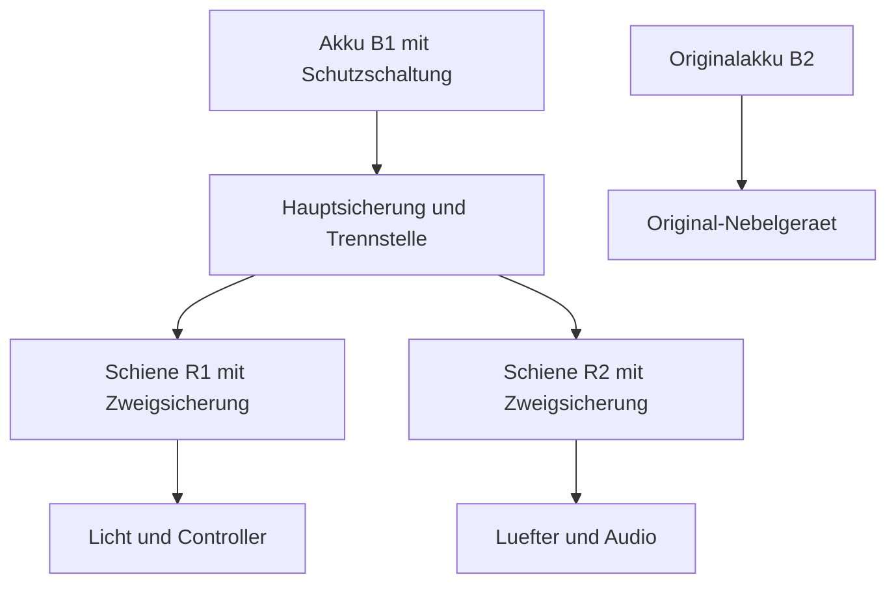

# MJOLNIR: technische Auslegung und Ausstellung

Dieses Arbeitsblatt verbindet die gewaehlte Ruestung mit konkreten elektrischen
Verbrauchern, Scharnieren und einem Ausstellungssockel. Die beigefuegte
Planrechnung verarbeitet ausschliesslich eingetragene Werte. Unbekannte Daten
bleiben `null`; das Werkzeug setzt weder Akkukapazitaet noch Lasten oder
Materialtragfaehigkeiten ein.

Ein bestandenes Softwaretestprotokoll bestaetigt die Rechenlogik. Es ersetzt
keine Wiegung, Messung, Montagepruefung oder Erprobung am Anzug.

## 1. Projekt anlegen und Ergebnisse erzeugen

```bash
python3 tools/suit_engineering.py --init build/Suit-A/Engineering.json --name Suit-A
python3 tools/suit_engineering.py --input build/Suit-A/Engineering.json --out build/Suit-A/Engineering
python3 tools/suit_engineering.py --input build/Suit-A/Engineering.json --out build/Suit-A/Engineering --check
```

`--init` ueberschreibt keine bestehende Datei. Ohne `--out` entstehen die
Ergebnisse neben der Eingabe im Unterordner `<Dateistamm>-engineering`.
`EngineeringReport.json` enthaelt die Ergebnisse, fehlende Eingabefelder und
den SHA-256 der Eingabedatei. `EngineeringReport.md` ist die lesbare Fassung.
Eine Quelldatei darf nicht mit einem Ausgabepfad kollidieren. Bestehende
Symlinks und Hardlinks auf die Eingabedatei werden ebenfalls vor dem Schreiben
beider Berichte abgefangen.

Nicht vorhandene Baugruppen werden ausdruecklich ausgewaehlt: `hinges: []`
steht fuer einen Aufbau ohne berechnete Scharniere, `stand: null` fuer einen
Aufbau ohne Sockel. Ein rein passiver Aufbau kann `batteries: []` und
`rails: []` verwenden. Der Report nennt diese Bereiche unter
`omitted_sections`; daraus entsteht keine Freigabe. Ein vorhandener, aber noch
nicht vermessener Sockel behaelt dagegen sein Objekt mit leeren Messfeldern.

[Template.json](../../Design/Engineering/Template.json) ist vollstaendig
unvermessen. [Demo.json](../../Design/Engineering/Demo.json) enthaelt erfundene
Zahlen zur nachvollziehbaren Rechenprobe:

```bash
python3 tools/suit_engineering.py --input Design/Engineering/Demo.json --out build/EngineeringDemo
```

Die Demo ist kein Bauvorschlag. Es gibt keinen automatischen Demo-Ersatz fuer
fehlende Werte. `status` ist `inputs_pending`, `synthetic` oder `entered`.
`entered` bedeutet lediglich manuell eingetragen; Messnachweise sind separat
zu fuehren. `hardware_approved` bleibt in jedem Report `false`.

## 2. Elektrische Architektur und Arbeitsblaetter

Jeder physisch getrennte Akku erhaelt genau eine Batterie-ID. Mehrere
Spannungsschienen desselben Akkus verweisen auf dieselbe ID; die nutzbare
Energie darf nicht pro Schiene erneut als eigener Akku angelegt werden.
Kommerzielle Nebelmodule mit eigenem Akku bleiben eigene Systeme. Eine
unveraenderte Original-Fernbedienung wird nicht elektrisch mit dem
Eigenbaucontroller verbunden.



Das Diagramm beschreibt die Architektur. Spannungen, Sicherungswerte,
Leitungsquerschnitte und Stecker bleiben vom ausgewaehlten Material abhaengig.
Alle Zweige benoetigen zu ihrer Stromquelle passende Schutzmassnahmen; die
Schutzschaltung eines Akkus ersetzt keine Beurteilung der angeschlossenen
Leitungen und Steckverbinder.

| Batterie-Arbeitsblatt | Einzutragende Angabe |
| --- | --- |
| ID und Produkt | Physischer Akku, Modell, Revision und verwendeter Ausgang |
| Nutzbare Energie | `usable_energy_wh` am Akkuausgang fuer die geplante Last, mit Messverfahren oder belastbarem Datenblattbezug |
| Lastgrenzen | Zulaessige Dauerlast, Spitzenlast samt Dauer, Abschaltverhalten |
| Anschluesse | Pinbelegung, Verpolschutz, zugentlastete und erreichbare Trennstelle |
| Montage | Halterung, mechanischer Schutz, erreichbare Entnahme, Freiraeume nach Herstellerangabe |
| Nachweis | Messdatei, Datum, Ladezustand, Testlast und Umgebung |

Eine mAh-Angabe ohne zugehoerige Spannung ist keine Wh-Eingabe. Zellenergie,
USB-Ausgangsenergie und nachgeschaltete Versorgung sind unterschiedliche
Messpunkte. Bei bereits am Akkuausgang gemessenen Wh werden interne
Akkuverluste nicht nochmals abgezogen. Der Schienenwirkungsgrad beschreibt
nur die nach diesem Messpunkt liegende Wandlung.

| Schienen-Arbeitsblatt | JSON-Feld und Bedeutung |
| --- | --- |
| Quelle | `battery_id`: bestehende Batterie-ID oder `null`, solange unbekannt |
| Spannung | `voltage_v`: Spannung am Verbraucheranschluss in V |
| Wirkungsgrad | `efficiency_fraction`: Verhaeltnis von Nutzleistung zu lastabhaengiger Eingangsleistung, groesser 0 bis 1 |
| Eigenverbrauch | `idle_input_w`: zusaetzlicher, nicht bereits im Wirkungsgrad enthaltener Leerlaufverbrauch am Akkuausgang |
| Sicherung | Typ, Bemessung, Abschaltkennlinie und Einbauort aus realer Leitung/Last auswaehlen; nicht vom Rechner vorgeschlagen |
| Leitung | Material, Querschnitt, Hin- und Ruecklaenge, Steckverbinder, Zugentlastung |
| Nachweis | Ausgangsspannung und Spannungsabfall bei realer Volllast; gemessene Erwaermung und Datenblattabgleich |

Ein gemessener Gesamtwirkungsgrad einschliesslich Leerlaufverlusten darf mit
`idle_input_w: 0` verwendet werden, wenn der Messpunkt und diese Abgrenzung im
Nachweis festgehalten sind. Ein unbekannter Eigenverbrauch bleibt `null`.
Der Rechner verwendet einen konstanten Wirkungsgrad; reale Lastabhaengigkeit
und Wandlerabschaltungen muessen im Versuch geprueft werden.

| Verbraucher-Arbeitsblatt | JSON-Feld und Bedeutung |
| --- | --- |
| Identifikation | `id`, Produkt und Funktion in der Begleitdokumentation |
| Anzahl | `quantity`: ganze Zahl groesser 0; ungenutzte Position entfernen |
| Eingeschaltete Leistung | `power_w`: Leistung je Einheit am Schienenausgang in W |
| Einschaltdauer | `duty_fraction`: zeitlicher Anteil 0 bis 1, einschliesslich dokumentierter Effektfolge |
| Spitzenleistung | `peak_power_w`: groesste angesetzte Leistung je Einheit, einschliesslich Startspitze; mindestens `power_w` |
| Messnachweis | Messgeraet, Abtastrate, Lastzustand und Dauer einer Spitze; Multimeter-Mittelwert erfasst nicht jede Startspitze |

Verbraucher mit relevanter Bereitschaftsleistung erhalten eine zusaetzliche,
staendig aktive Position. Ein Prozentwert wie `50` ist ungueltig; 50 Prozent
entsprechen `0.5`. Entfernte oder nicht vorhandene Baugruppen muessen aus den
Listen entfernt werden. Jede verbleibende Schiene benoetigt mindestens einen
Verbraucher.

Die Berechnungen lauten:

- Mittelwert einer Schiene: Summe aus Anzahl mal eingeschalteter Leistung mal Einschaltdauer.
- Gleichzeitige Volllast: Summe aus Anzahl mal eingeschalteter Leistung, ohne Einschaltdauer-Abschlag.
- Angegebene Spitze: Summe aus Anzahl mal angegebener Spitzenleistung. Fehlende Spitzen werden nicht durch Dauerlast ersetzt.
- Schienenstrom: jeweilige Leistung geteilt durch eingetragene Spannung.
- Mittlere Akku-Eingangsleistung je Schiene: Schienenmittelwert geteilt durch Wirkungsgrad plus Eigenverbrauch.
- Akkulaufzeit: nutzbare Wh geteilt durch die Summe der mittleren Eingangsleistungen aller zugeordneten Schienen.
- Energie fuer die Zielzeit: mittlere Akku-Eingangsleistung mal `target_duration_h`.

Die Systemlaufzeit ist die kuerzeste berechenbare Laufzeit der benoetigten
Akkus. Ein unbekannter Strombedarf wird nicht als Null gerechnet. Bei Null-Last
entsteht keine unendliche Laufzeit. Unzugeordnete Schienen verhindern eine
Systemlaufzeit. Ein positiver Energieueberschuss bewertet keine Stromspitze,
Akkutemperatur, Schaltfestigkeit oder elektrisch zulaessige Belastung.

## 3. Scharnier und manuelle Oeffnung

Die Rechnung behandelt das Gewichtsmoment eines einzelnen Panels:

`Moment_Nm = Masse_kg * 9.80665 * Abstand_m * Achsfaktor`.

`com_distance_m` ist der Abstand von der Drehachse zum Schwerpunkt des
kompletten bewegten Panels einschliesslich Lack, Griffen und Anbauteilen.
`gravity_axis_factor` ist der Betrag der Projektion des Gewichtsmoments auf
die tatsaechliche Drehachse, normiert auf Masse mal Erdbeschleunigung mal
Abstand. Der Faktor liegt zwischen 0 und 1. Bei waagerechter Achse entspricht
er dem Betrag des Sinus zwischen dem radialen Schwerpunkthebel und der
Gewichtskraft; bei senkrechter Tuerachse ist er 0. Ein unbekannter Achswinkel
bleibt offen. Auch bei einem oeffnenden Gewichtsmoment von 0 koennen erhebliche
Lagerkraefte und Biegemomente auftreten.

| Mechanik-Arbeitsblatt | Noch zu bestimmen |
| --- | --- |
| Panel | Tatsaechliche Masse und Schwerpunktlage in mehreren Oeffnungsstellungen |
| Lagerung | Anzahl und Abstand der Lager, Achsdurchmesser, Material, Spiel und Halterung |
| Befestigung | Schrauben, Einbettung, Gegenplatten, Schalenmaterial und reale Belastungsrichtung |
| Verriegelung | Kraftpfad im geschlossenen Zustand, manuelle Bedienung innen/aussen |
| Entkopplung | Trennstellen fuer Kabel und Schlaeuche; keine Leitungsbruecke ueber Notausstieg |
| Pruefung | Erst am Tisch, danach am Traegerrahmen; Kollisions-, Wiederholungs- und Loesetest dokumentieren |

Das berechnete Moment ist keine Scharnierfreigabe und keine Aktorauswahl.
Reibung, Anschlag, Stoss, Materialermuedung, Schraubenauszug und Lagerkraefte
sind nicht enthalten. Die Oeffnung bleibt ohne elektrische Energie bedienbar.

## 4. Sockel und Schwerpunkt

Der Sockel wird fuer eine unbesetzte Ausstellung geplant. Der Rechner setzt
eine ebene, starre Standflaeche und ein rechteckiges tatsaechliches
Aufstandspolygon voraus. Die Abmessungen der Dekorplatte sind nur dann die
Stuetzweite, wenn sie auch die wirksamen Bodenkontakte beschreiben.

| Sockel-Arbeitsblatt | JSON-Feld |
| --- | --- |
| Gesamtmasse inklusive Ruestung, Rahmen, Technik und Ballast | `total_mass_kg` |
| Wirksame Stuetzweite links/rechts und vorne/hinten in m | `base_width_x_m`, `base_width_y_m` |
| Schwerpunktversatz gegen die Mitte des Aufstandspolygons in m | `com_x_m`, `com_y_m`; Vorzeichen ausdruecklich zulaessig |
| Waagerechte Kraft-Betragsgrenzen je Achse in N | `force_x_n`, `force_y_n`; jeweils als nichtnegative Betraege |
| Angriffshoehe dieser Kraefte ueber dem Boden in m | `force_height_m` |

Die Bilanz beschreibt vier richtungsweise unguenstige Lastfaelle: `force_x_n`
wird einmal gegen die +X-Kante und einmal gegen die -X-Kante angesetzt,
`force_y_n` entsprechend gegen +Y und -Y. Die Zahlen sind Betragsgrenzen
je Achse, kein einzelner gleichzeitiger Kraftvektor. Ein konkreter
gleichzeitiger oder dynamischer Lastverlauf wird damit nicht simuliert.

Das Rueckstellmoment ist Gewichtskraft mal verbleibender Abstand zwischen
Schwerpunktprojektion und Kippkante. Das Kippmoment ist der jeweilige
Kraftbetrag mal Angriffshoehe. Die Differenz wird mit Vorzeichen ausgegeben.
Ein Schwerpunkt ausserhalb einer Kippkante erzeugt bereits ein negatives
Rueckstellmoment.

Die fuer die Rechnung verwendeten Kraefte benoetigen eine nachvollziehbare
Projektvorgabe. Die synthetische Demo legt keine erlaubte Besucherkraft fest.
Eine positive Momentdifferenz ist nur das Ergebnis dieses Lastfalls. Sie
enthaelt keine Reserveforderung und keinen Nachweis gegen Rutschen,
Durchbiegung, Verbindungsbruch, Stoss, Klettern, dynamische Oeffnung oder
Unebenheiten. Verankerungen und Bodenvertraeglichkeit sind separat zu planen.

Fuer jede andere Aufstellung und jeden schweren Umbau sind Schwerpunkt,
Lastfall und Aufnahme erneut zu dokumentieren. Bei geoeffneten Panels muss die
Schwerpunktlage der geoeffneten Stellung verwendet werden.

## 5. Helm: Visier-, Luefter- und Audioversuch

Vor dem fertigen Helm entsteht ein austauschbarer Probeaufbau mit Visier,
Polsterung, Luftkanaelen, Mikrofon und Lautsprecher. Visierform und Toenung
werden gegen die gewaehlte Ruestungsreferenz geprueft. Die Lueftung benoetigt
einen freien Einlass und Auslass; eine Nenn-Foerdermenge des Luefters bestaetigt
keinen Luftstrom durch das verbaute Visier.

| Schritt | Dokumentierbarer Nachweis |
| --- | --- |
| Optik ohne Elektronik | Frontal- und Seitenfoto, sichtbare Reflexionen, Lesbarkeit von Orientierungspunkten, Verzerrung im Bewegungsbereich |
| Blick nach unten | Sicht auf Bodenmarkierungen und Schuhposition; separate gesicherte Gehprobe erst nach statischer Passprobe |
| Visierbefestigung | Loesen ohne Spezialwerkzeug, Abstand zu Gesicht/Brille, zugfreie Halterung |
| Luftfuehrung | Vergleich mit/ohne Visier, Ein- und Auslassposition, Luftstromnachweis am tatsaechlichen Kanal |
| Beschlagen | Umgebung, Dauer, Beobachtung, Luefterzustand und Ergebnis erfassen; keine pauschale thermische Freigabe |
| Sprache | Gleiche Wortliste mit offenem Helm, geschlossenem Helm und laufendem Luefter aufnehmen; Verstaendlichkeit durch zweite Person protokollieren |
| Audioeffekt | Lautsprecher vom Mikrofon entkoppeln, Rueckkopplung und Stoergeraeusche in realer Aufstellung pruefen |
| Bedienung | Stummschaltung, Luefterbedienung und Helmabnahme im vollstaendigen Aufbau erreichbar |
| Aussenwahrnehmung | Verstaendlichkeit von Gespraechen und akustischen Signalen bei geplanter Lautstaerke beobachten |

Luefter- und Audiozustand werden dabei nicht nur anhand von Softwarebefehlen
als funktionierend bewertet. Es zaehlt der reale Luftstrom beziehungsweise
das reale Tonsignal. Abbruchgruende und Pausen werden vor der Trageprobe
festgelegt; Beschwerden fuehren zum Absetzen und zur Anpassung des Aufbaus.

## 6. Ausstellung, Transport und Vorfuehrung

### Montage und Wartung

- Rahmen und Ruestungsaufnahme eindeutig kennzeichnen; Gewichtskraefte ueber die geplanten Aufnahmen einleiten.
- Akkus, Nebelgeraet und Verschleissteile ohne Zerlegen der kompletten Lackierung erreichen.
- Kabel und Schlaeuche entlang der geplanten Oeffnungsbewegung zugentlasten; abnehmbare Bauteile erhalten passende Trennstellen.
- Standfuss, Verankerung und verdeckte Versorgung anhand der tatsaechlichen Stellflaeche abgleichen.
- Keine weitere tragende Funktion aus dekorativen 3D-Druckteilen ableiten.

### Packliste je Projekt und Revision

| Packgruppe | Inhalt und Kontrolle |
| --- | --- |
| Ruestung | Bauteil-ID, Foto, Masse, gepolstertes Fach und Einbaureihenfolge |
| Sockel | Rahmen, Stuetzelemente, Verbindungsmittel, Montagewerkzeug und Bodenauflagen |
| Elektronik | Beschriftete Baugruppen, passende Ladegeraete, Ersatzsicherungen gemaess Auslegung, Anschlussplan |
| Nebeleffekt | Originalgeraet und Bedienung, zum Geraet freigegebenes Fluid, verschlossene Behaelter, Reinigung gemaess Hersteller |
| Wartung | Fuer den Aufbau geeignete Ersatzverschluesse, Kabelbinder, Textilband, Reinigung und Montagehilfe |
| Nachweise | Aktuelle Konfiguration, Bauteilliste, Messprotokolle, Aufbauanleitung und dokumentierte Veranstaltungsabstimmung |

Transportbedingungen fuer Akkus und Fluide sind fuer Verkehrsmittel und
Veranstaltung gesondert zu klaeren. Diese Checkliste ersetzt deren Vorgaben
nicht und behauptet keine bestehende gamescom- oder IFA-Zulassung.

### Wiederholbarer Vorfuehrablauf

1. Aufbau-ID und Revision abgleichen; Befestigung, Bodenkontakt und Leitungswege kontrollieren.
2. Anzeige mit richtigem Projekt laden; simulierte Werte bleiben als solche gekennzeichnet.
3. Licht und Audio einzeln pruefen; anschliessend geplante gemeinsame Last messen.
4. Oeffnungsbewegung im vorgesehenen Freiraum vorfuehren; Wartungs- und Fluchtwege frei halten.
5. Nebel nur bei vorhandener veranstaltungsbezogener Abstimmung und abgeschlossenem Nebel-Pruefprotokoll ausloesen. Sonst Lichtsequenz verwenden.
6. Nach der Sequenz Verriegelung, Kondensat, lockere Teile und veraenderte Leitungswege kontrollieren.
7. Wiederholungen, Stoerungen und Wartung im Projektprotokoll erfassen; geaenderte Teile fuehren zu einer neuen Revision.

Automatische Nebelausloesung ist damit nicht implementiert. Die
Originalbedienung bleibt das vorgesehene Verfahren. Eine spaetere
Synchronisation benoetigt eine dokumentierte Herstellerschnittstelle sowie
separate Fehler- und Abschalttests.

## 7. Ergebnis und offene reale Arbeiten

Die Werkzeugkette liefert jetzt ausfuellbare Eingaben, wiederholbare
Berechnungen und pruefbare Berichte. Fuer die konkrete Hardware bleiben
Produktdatenblaetter, Wiegungen, elektrische Lastmessungen, Schwerpunktlage,
reale Montage und die beschriebenen Funktionstests erforderlich.

Verknuepfte Grundlagen:

- [Projektkonfiguration](Mjolnir-Konfiguration.md)
- [Einstiegsmechanik](Mjolnir-Einstieg.md)
- [Pruefregister](../../Tests/TestReports/Mjolnir-Abnahme.md)
