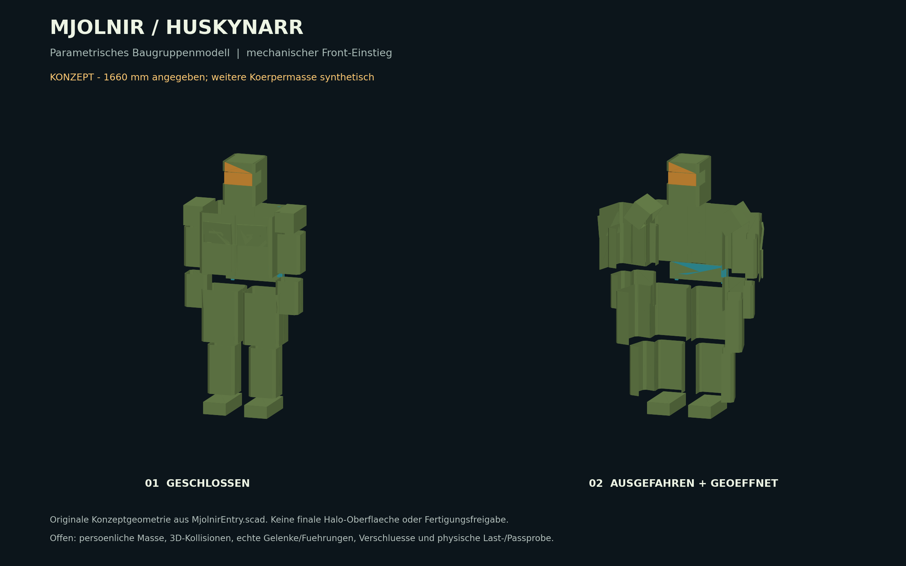

# HaloCosplay: Master Chief MJOLNIR Projekt

Dieses Repository ist eine DIY-Projektmappe fuer ein moeglichst authentisches Halo Master Chief Cosplay mit Ruestung, Helm, Prop-Waffe und optionaler Elektronik (HUD, Akku-Backpack, AR/Display). Das Projekt ist in drei Varianten strukturiert: Einsteiger (Foam), Fortgeschritten (3D-Druck/Hybrid) und Profi (Exoskelett + Premium-Materialien).

## Aktueller persoenlicher Entwurf: MJOLNIR V4 fuer Huskynarr

**1660 mm Koerpergroesse, breite Schultern, mechanischer Einstieg und optionales
Serien-Exoskelett.** Der neue Pfad fuehrt von vermessbaren Baugruppen zum Prototyp.
Er ersetzt die bisherigen pauschalen Stelzen-/Pantograph- und Skalierungsvorgaben
fuer diesen persoenlichen Build. Grundfunktion: Seitenfluegel ausfahren,
Frontschalen aufklappen, in vormontierte Kassetten einsteigen und Handverschluesse
schliessen. Eine Anziehstation haelt die ungetragene Ruestung bereit.

- [Systementwurf und Baugruppen](Documentation/Guides/Mjolnir-Systementwurf.md)
- [Einstieg, Verriegelung und Anziehstation](Documentation/Guides/Mjolnir-Einstieg.md)
- [Massanpassung fuer 166 cm und breite Schultern](Documentation/Guides/Mjolnir-Massanpassung.md)
- [Exoskelett: Hypershell / DNSYS und eigener Traeger](Documentation/Guides/Exoskelett.md)
- [Parametrisches 3D-Modell mit Oeffnungsanimation](Design/Parametric/README.md)
- [Bezahlbare Hardware fuer den ersten Prototyp](Materials/Mjolnir-Einkauf-Prototyp.md)
- [Stueckliste, Kosten- und Gewichtsbudget](Materials/Mjolnir-BOM.md)
- [Prototypenfolge und Abnahmekriterien](BuildGuides/Armor/Mjolnir-Prototypen.md)

**Stand:** Konzept-CAD und Berechnungswerkzeuge, keine fertige Druckruestung.
31 erforderliche lineare Masse sind noch offen. Das echte Profil enthaelt dafuer
Nullwerte; die gesonderte Konzeptansicht verwendet klar markierte Beispielmasse.
Es wurden keine Koerpermasse oder Gewichte aus Instagram erfunden.
Die leeren alten STL-Dateien sind weiterhin Platzhalter.



```bash
python3 tools/suit_fit.py --concept --out Design/Parametric/Generated
python3 tools/suit_budget.py --check
python3 -m unittest discover -s Tests/Automation -v
```

Die allgemeine Web-/Guide-Sammlung bleibt darunter als Materialreferenz erhalten.


## V4: Authentizitaet und Messebetrieb

Der persoenliche Zielstand ist Master Chief aus Halo Infinite (Mark VI GEN3).
V1-V3 bleiben allgemeine Material-/Technikreferenzen. Fuer V4 gelten vorrangig:

- [Verbindliche Referenz und optische Abnahme](Documentation/Guides/Authentizitaet-Referenz.md)
- [Fertigungsplan und Baugruppenschnittstellen](Documentation/Guides/Mjolnir-Fertigung.md)
- [Messebetrieb fuer gamescom und IFA](Documentation/Guides/Mjolnir-Messebetrieb.md)
- [Reale Abnahmeprotokolle](Tests/TestReports/Mjolnir-Abnahme.md)
- [Aktueller Nachweisstatus](Progress/Mjolnir-Readiness.md)
- [Offline-Messeanzeige](Code/Exhibition/README.md)

Die Messeanzeige ist eine reine Praesentation ohne Antriebssteuerung. Keine
Hardwarepruefung, Detailruestung oder Veranstalterfreigabe wird als abgeschlossen markiert.

## Web-Version (durchklickbar)

Es gibt eine durchklickbare Web-Version aller Guides im Halo/HUD-Design, die die
Markdown-Dateien live rendert und Fortschritt + Einkaufs-Haken lokal im Browser
speichert (LocalStorage): **https://huskynarr.github.io/HaloCosplay/**

- Quellcode und lokale Nutzung: `web/README.md`
- Deploy laeuft automatisch (`.github/workflows/pages.yml`); in den Repo-Settings
  unter Pages als Source "GitHub Actions" waehlen.

## Varianten im Ueberblick

| Variante | Ziel | Materialien | Technik | Budget (Richtwert) | Dauer (Richtwert) |
| --- | --- | --- | --- | --- | --- |
| V1 Einsteiger | klassisches Cosplay | EVA-Foam, Kunststoff, Holz | einfache LEDs | 800-2.700 EUR | 2-5 Monate |
| V2 Fortgeschritten | detailstark + stabil | 3D-Druck + Foam | HUD + Pi, Akku | 2.400-6.600 EUR | 4-8 Monate |
| V3 Profi | High-End + Exoskelett | Alu/Carbon, CNC/3D | HUD, Sensorik, Exo | 6.000+ EUR | 8-14 Monate |

## Hinweis zu Kosten

Die Kosten sind stark abhaengig von Tools, Fehlversuchen, Versand und Premium-Materialien. Realistisch ist oft das 2-3x der Minimalannahmen.

## Projektziele

- **Authentische MJOLNIR-Optik:** Halo Infinite Mark VI GEN3 nach festgelegten Referenzen und geprueften Farbmustern.
- **Tragbarkeit als Entwicklungsziel:** Modularer Aufbau; Notausstieg <60 Sekunden als noch zu pruefendes Ziel.
- **Ruestungstraeger und Exoskelett (V4):** Eigener leichter Traeger, mechanisch oeffnende Kassetten und separat passend ausgewaehltes Serien-Exoskelett. Kein ungepruefter Lastpfad zum Boden.
- **AR HUD & OpenCV (V3):** Near-Eye-Display (NED/Vufine) mit Pi 4/5, OpenCV-Bildverarbeitung (Freund-Feind-Erkennung / IFF), Nachtsicht, digitalem Zoom und BT-Waffentelemetrie.
- **Munitionszaehler (MA40/MA5):** Integrierte Zaehlerelektronik (Arduino/Pico) mit SSD1306-OLED-Anzeige, Schussabnahme am Abzug und Reload-Erkennung.

## Quick Start

1. **Roter Faden / Komplett-Walkthrough (Anfaenger bis Profi):** `Documentation/Guides/Komplett-Walkthrough.md`
2. **Start-Here-Guide lesen:** `Documentation/Guides/Start-Hier.md`
3. **Projektuebersicht lesen:** `Documentation/README.md`
4. **Variante waehlen (V1 Foam, V2 3D-Druck, V3 Exoskelett):** `Documentation/Guides/Varianten.md`
5. **TODO-Liste nutzen:** `Documentation/TODO.md`
6. **Allgemeine Bauplanung (persoenliche Masse nach V4):** `BuildGuides/Armor/Step1.md`
7. **Exoskelett-Integration und eigener Traeger:** `Documentation/Guides/Exoskelett.md`
8. **Schubduesen & Nebeleffekte:** [Elektronik-Schubduesen.md](Documentation/Guides/Elektronik-Schubduesen.md)
9. **Kosten und Zeitplan:** `Documentation/Guides/Kosten.md` und `Documentation/Guides/Zeitplan.md`
10. **Elektronik-Systemplanung:** `Documentation/Guides/Elektronik-HUD.md`, fuer V3 das Gesamtsystem `Documentation/Guides/V3-Systemarchitektur.md`
11. **Einkaufen:** Komponenten `Materials/ShoppingList.md`, direkte Kauflinks `Materials/Einkaufsliste-Links.md`
12. **Code-Uebersicht (OLED HUD, AR, LED-Effekte, Ammo-Counter):** `Code/README.md`

## Projektstruktur

- `Documentation/` Projektuebersicht, Sicherheits- und Technikdokumentation
- `Documentation/TODO.md` **Haupt-Todoliste** fuer das gesamte Projekt
- `BuildGuides/` Schritt-fuer-Schritt Bauphasen (Ruestung, Helm, Elektronik)
- `Materials/` Einkaufslisten, Komponenten und Quellen
- `Code/` Beispielcode fuer HUD, LEDs und Controller
- `Design/` Skizzen, Vorlagen, 3D-Modelle
- `Resources/` Tools, Links, STL-Quellen, Community, Referenzen
- `Support/` FAQ und Kontakt

## Sicherheit und Conventions

- Siehe `Documentation/Guides/Sicherheit.md`
- Siehe `Documentation/Guides/Convention-Regeln.md`

## Support

- FAQ: `Support/FAQ.md`
- Kontakt: `Support/Contact.md`

## Community

- 405th Infantry Division: https://www.405th.com/
- RPF: https://www.therpf.com/

Viel Erfolg beim Bau. Schritt fuer Schritt, und immer zuerst die sichere Tragbarkeit testen.
